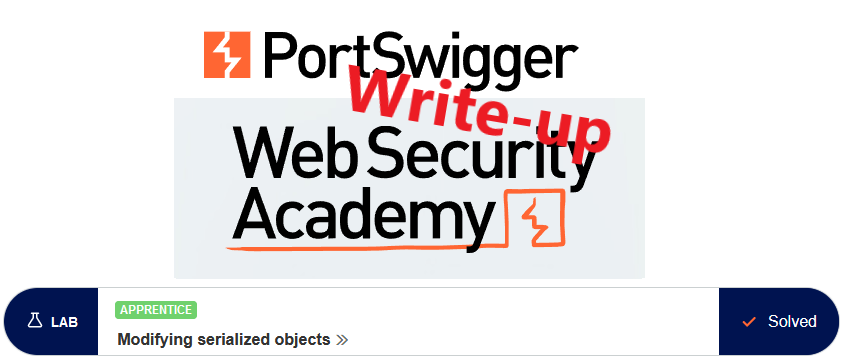
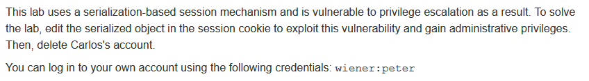
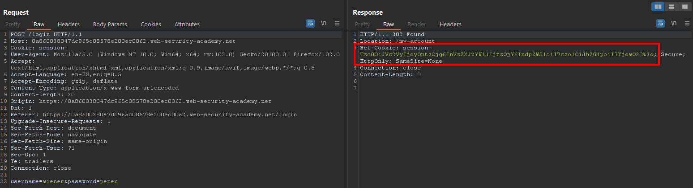
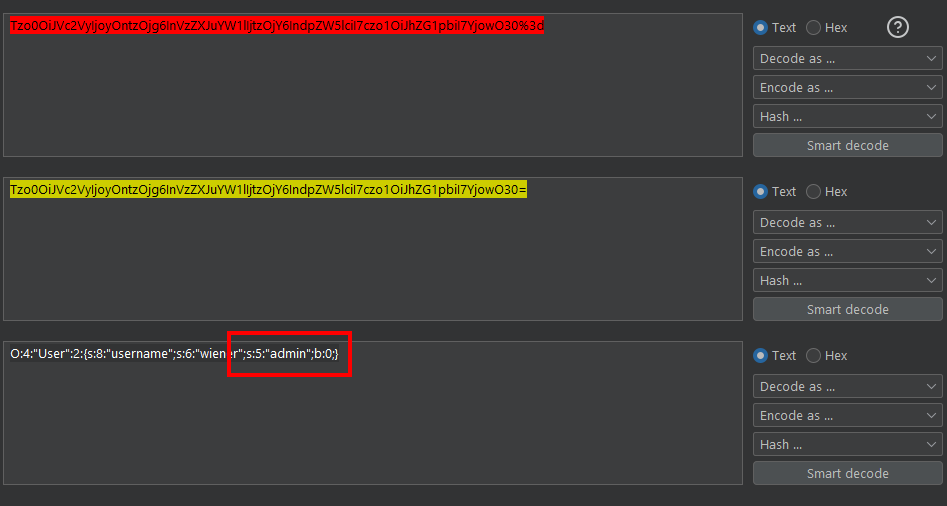
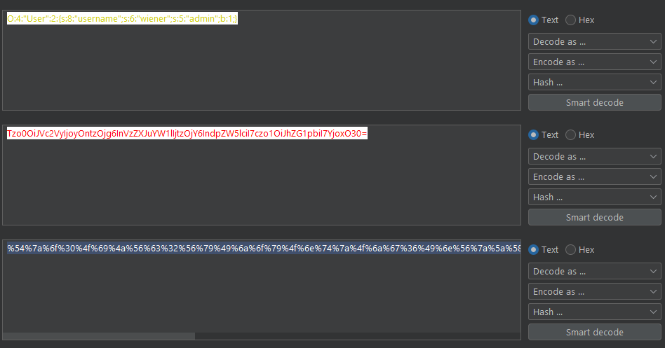
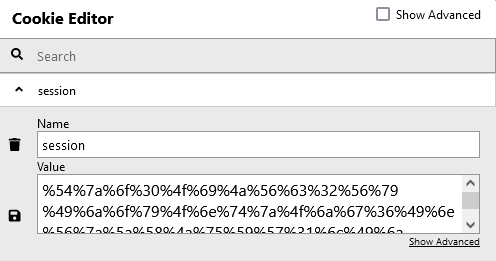
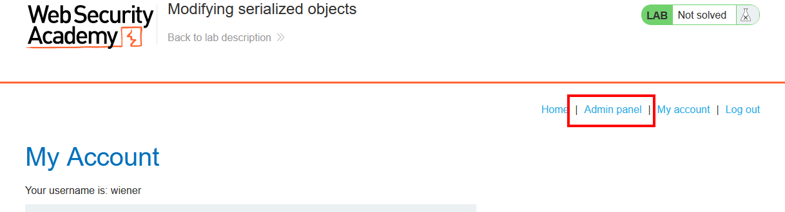

# Write-up: Modifying serialized objects @ PortSwigger Academy

This write-up for the lab *Modifying serialized objects* is part of my walk-through series for [PortSwigger's Web Security Academy](https://portswigger.net/web-security).

**Learning path**: Advanced topics → Insecure deserialization

Lab-Link: <https://portswigger.net/web-security/deserialization/exploiting/lab-deserialization-modifying-serialized-objects>  
Difficulty: APPRENTICE  
Python script: [script.py](script.py)  

## Lab description

## Steps

### Analysis

As usual, the first step is to analyze the functionality of the lab application. In this lab, it is a shop website.

The description described the vulnerability is in the session management, so I use the credentials provided to log into the account of `wiener`.

In the HTTP history of Burp Proxy, I see a session cookie that is sent in the response.

The cookie value looks encoded, so I send it to Burp Decoder and decode it twice, first URLdecode followed by base64-decode:

The result shows a PHP object that describes the user, including one rather interesting `admin` member.

### The theory

Generally, it is a bad idea to store anything on the client other than a single identifier for a session that is held on the server. This web application appears to store details of the user session on the client. 

A lot of web applications do it right nowadays, not the least thanks to good frameworks that provide this out of the box.

What I see sometimes is that some developers shy away from real sessions. In a lot of cases, this is because of decisions to make the application scalable by designing it as REST application. 'Scalable' is a very common buzzword that generates a lot of management buy-in, as a developer, it is hard to avoid or even resist.

The first obvious 'solution' is to offload the session management to the client. Storing it in a cookie ensures it is sent with every request.

The problem is that the data used in the security decisions are stored client-side and thus out of the trusted scope of the application. 

Such solutions basically re-implement session management without the actual security benefits session management provides out of the box.

A variation of this is storing a JWT access token in the cookie to ensure the application is also 'portable' (another common buzzword).

Thus, while the example in this lab is quite contrived of course, it is very much relevant still as long as such 'scalable' and 'portable' solutions are being developed.

### The malicious payload

If the application does not perform any checks on the cookie value, like comparing it with known internal session data, then it is easy to exploit this vulnerability.

I change the admin flag to `1` and re-encode it:

The decoder encodes every character, even though only the `=` needs to be encoded. I could also just replace the `=` with `%3d` manually, but it works also like this.

I now need to store the new value in my browser so that it is sent with the following requests:

After refreshing the account page of `wiener`, a new link is visible in the top menu: `Admin panel`.

Here, I see all users and can perform administrative activities like deleting them:

Once I delete user `carlos`, the lab updates to

---

If you found this article helpful, please give it a clap. To get notified of more write-ups, follow me on [GitHub](https://github.com/frank-leitner) or [medium](https://medium.com/@frank.leitner).
