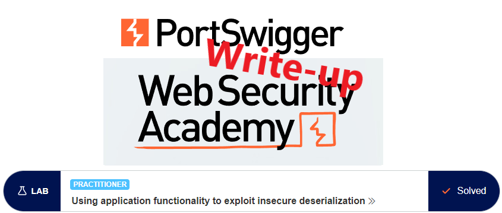
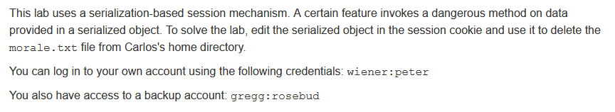
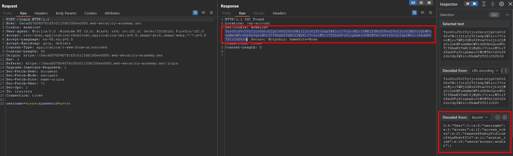
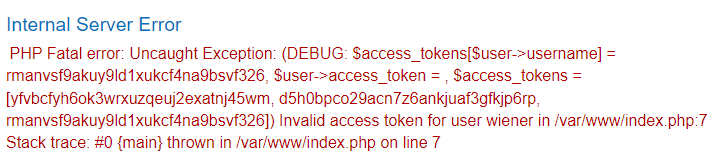
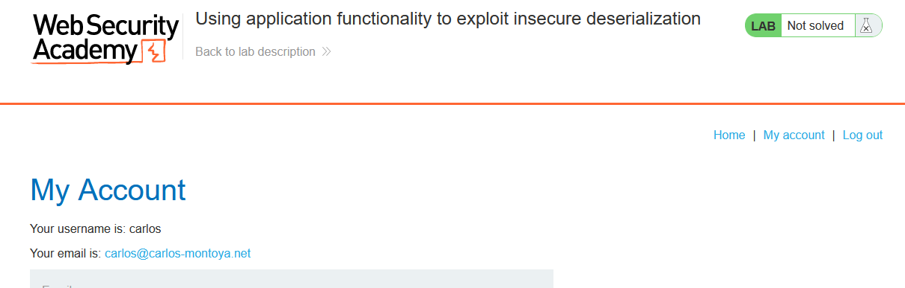
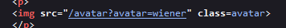
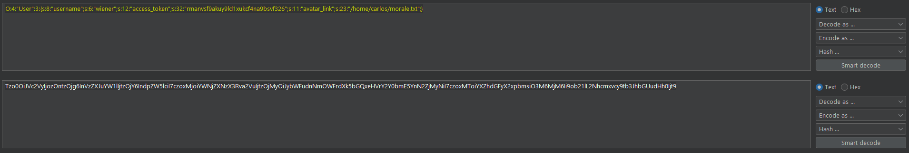
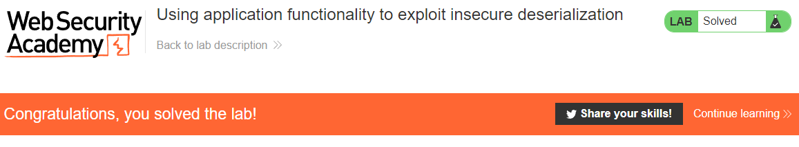

# Write-up: Using application functionality to exploit insecure deserialization @ PortSwigger Academy



This write-up for the lab *Using application functionality to exploit insecure deserialization* is part of my walk-through series for [PortSwigger's Web Security Academy](https://portswigger.net/web-security).

**Learning path**: Advanced topics → Insecure deserialization

Lab-Link: <https://portswigger.net/web-security/deserialization/exploiting/lab-deserialization-using-application-functionality-to-exploit-insecure-deserialization>  
Difficulty: PRACTITIONER  
Python script: [script.py](script.py)  

## Lab description



## Steps

### Analysis

As usual, the first step is to analyze the functionality of the lab application. In this lab, it is a blog website.

The vulnerability is in authenticated functionality, so I log in with the known credentials of `wiener` and look at the response:



The application sets a cookie that looks like base64 encoded. Selecting it shows the decoded string directly in the inspector. 

The cookie contains the username, an access token for this user and the path of the avatar image.

---

### Leaked access tokens

While this is not in the scope of this lab, the application leaks the access tokens of all users when a boolean value is used as the access token:



This way, access to any account is possible as long as its username is known, for example, the account of `carlos`:



As this is not the content of this lab, I won't go further here.

---

### The theory

To improve readability, I format the token so that each line contains one variable:

```
O:4:"User":3:{
    s:8:"username";s:6:"wiener";
    s:12:"access_token";s:32:"rmanvsf9akuy9ld1xukcf4na9bsvf326";
    s:11:"avatar_link";s:19:"users/wiener/avatar";
}
```

The username and access_tokens are fairly straightforward. The avatar_link contains a relative path. Surprisingly, the path contains the username too.

In an ideal world, the avatar link would always be evaluated inside the user directory without the need to include it in the link explicitly.

But in any case, whether the directory is explicitly given or implicitly, the application needs to ensure the link points to a target that belongs to this user.

The application does not even use the path provided in the cookie for normal operation. When I change the avatar, the application gets the image by the username:



Any type of interaction with that avatar should always be referenced with the username and cross-checked against the access token (ignoring the access token leak mentioned above).

---

### The malicious payload

The lab description indicates that some of the data stored in the cookie are used during file deletion. That means that the application does not perform the basic steps outlined above but relies on the data in the cookie.

So I use the absolute path `/home/carlos/morale.txt` as my avatar link and base64-encode it. As the encoded string does not end with `=`, I do not need to also URL-encode it. Don't forget to update the length of the string:



Now I refresh the page and delete my account by using the `Delete account` button. The lab updates to



---

If you found this article helpful, please give it a clap. To get notified of more write-ups, follow me on [GitHub](https://github.com/frank-leitner) or [medium](https://medium.com/@frank.leitner).
