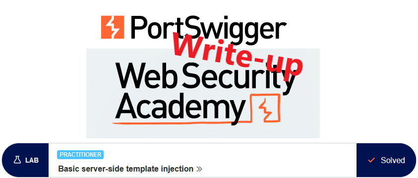
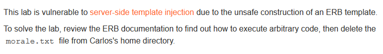
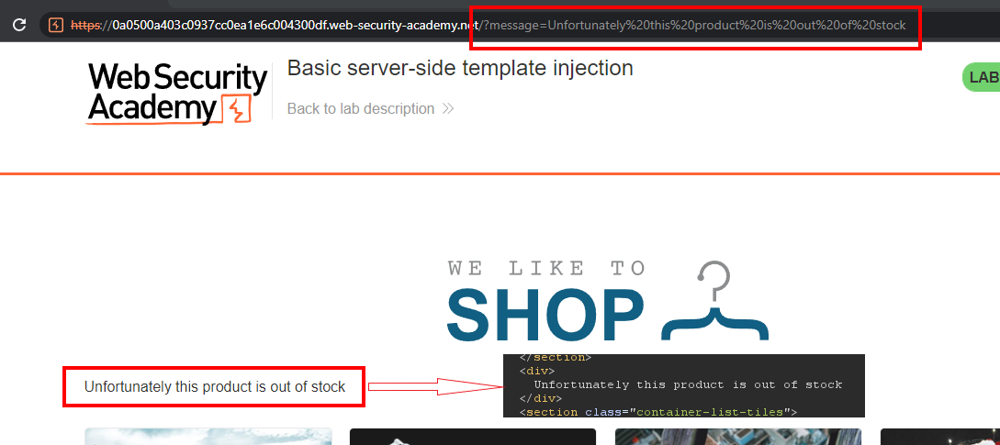
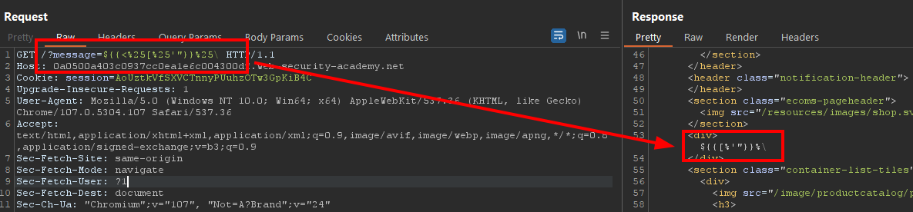
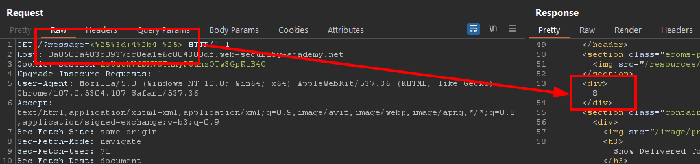
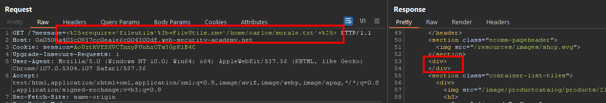

# Write-up: Basic server-side template injection @ PortSwigger Academy

This write-up for the lab *Basic server-side template injection* is part of my walk-through series for [PortSwigger's Web Security Academy](https://portswigger.net/web-security).

**Learning path**: Advanced topics → Server-side template injection

Lab-Link: <https://portswigger.net/web-security/server-side-template-injection/exploiting/lab-server-side-template-injection-basic>  
Difficulty: PRACTITIONER  
Python script: [script.py](script.py)  

## Lab description

## Steps

### Analysis

As usual, the first step is to analyze the functionality of the lab application. In this lab, it is a shop website.

I'm not provided with any credentials nor is there any login functionality. Therefore the vulnerability is on the public page. I browse a bit to check the application's usage of URL parameters.

For the product details, the `productID` is passed via the URL which is used by the application to load the proper information.

For one product, I receive an out-of-stock notification. The link on the page contains the normal `productID` argument. It appears that the application checks availability server-side. If a product is out of stock, the server redirects to the main page with the corresponding message as a URL parameter. The browser then requests this page:

The response contains the message embedded within a `div` tag.

---

### Finding the vulnerability

I don't know if any sanitization is done on the message text. But the very existence of the full message text as URL parameter merits a closer look. 

To perform various tests I send the `/?message=` request to Burp Repeater.

As a first check, I test a message containing various urlencoded special characters that are often used in templates `${{<%[%'"}}%\`:

The result shows that the characters `<%` are not contained in the response. It may be due to some sanitization or because it was evaluated by some logic (e.g. a template engine) on the server. 

The lab description references ERB templates, so I go check the [documentation for Ruby templates](https://docs.ruby-lang.org/en/2.3.0/ERB.html).

The documentation states that `<%` and `%>` are used as the start and end of template expressions respectively. This corresponds to my finding above.

An expression can be evaluated with the syntax `<%= Ruby expression %>`, so I try to execute a simple math operation:

The response contains the mathematical result instead of the message text. This indicates that I can execute arbitrary ERB expressions on the server.

---

### The malicious payload

The ERB documentation states that arbitrary ruby code can be executed by `<% Ruby code -- inline with output %>`. 

I continue searching the documentation until I find the proper method to [remove a file](https://docs.ruby-lang.org/en/2.3.0/FileUtils.html#method-c-rm).

Now I have all the information required to craft my malicious payload. The fileutils module is not available directly, so I need to require it first: `<% require 'fileutils'; FileUtils.rm '/home/carlos/morale.txt' %>`

The request does not result in any error. The `div` is empty but this is expected as `FileUtils.rm` does not return anything. Refreshing the lab application in the browser shows that the lab is solved:

---

## How to avoid this flaw

Most of these issues could be avoided by not including the message text in the URL but using an ID together with a server-side lookup table containing the messages (it is much easier to sanitize a known ID format than an arbitrary text message).
