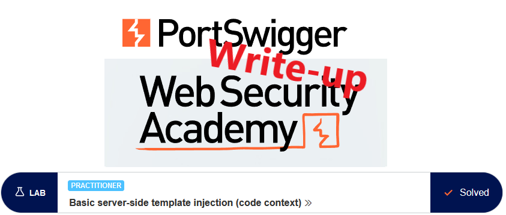
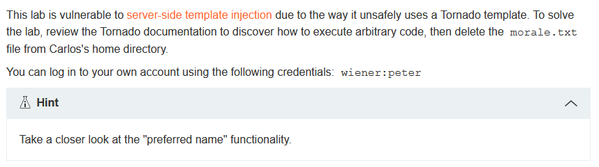
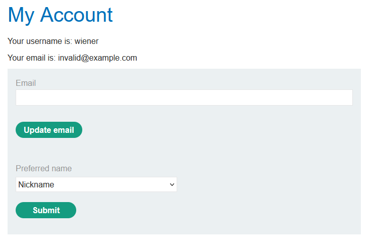
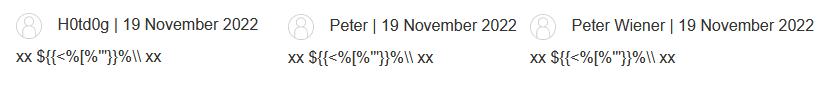
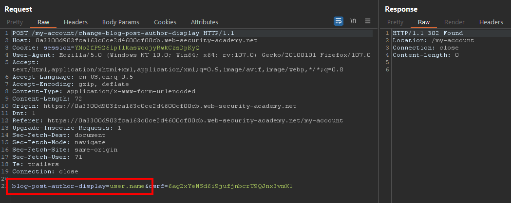
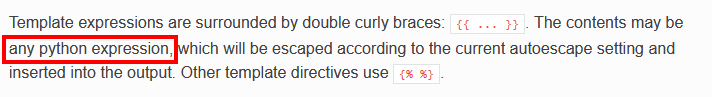
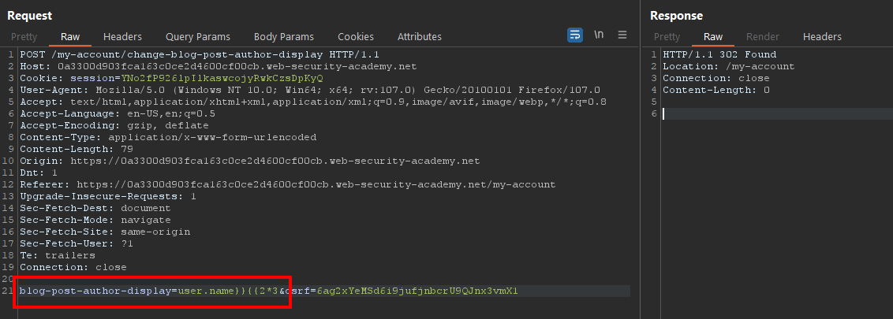
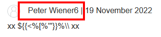
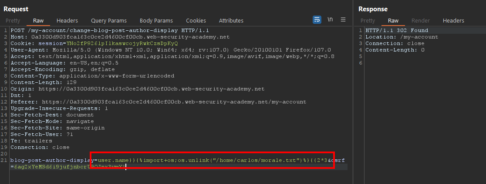
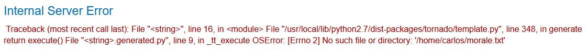

# Write-up: Basic server-side template injection (code context) @ PortSwigger Academy

This write-up for the lab *Basic server-side template injection (code context)* is part of my walk-through series for [PortSwigger's Web Security Academy](https://portswigger.net/web-security).

**Learning path**: Advanced topics → Server-side template injection

Lab-Link: <https://portswigger.net/web-security/server-side-template-injection/exploiting/lab-server-side-template-injection-basic-code-context>  
Difficulty: PRACTITIONER  
Python script: [script.py](script.py)  

## Lab description

## Steps

### Analysis

As usual, the first step is to analyze the functionality of the lab application. In this lab, it is a blog website to which I am provided credentials.

The public page does not show anything interesting. When I post a comment it will appear as anonymous but it does not appear to contain something I want.

I continue to log in as `wiener`. On my account page, I can change my email and set a preferred name. I guess it will be used as the user name when posting something on the blog:

Changing the email address does not lead to anything substantial. Changing the `preferred name` indeed changes the name of comments posted:

What is more interesting though is the request that is sent when changing the preferred name:

The value of the name argument appears to contain some reference to a data structure: `user.name` or, in case of the other options, `user.nickname` and `user.first_name`.

A secure way would be to use the client-provided value just as a plain index in a lookup table without actually using it directly. More often than not this is not the case though. The input, with more or less sanitization applied to it, is used in actual logic and might cause havoc.

---

### The theory

The lab description mentions tornado templates so I check out its [documentation](https://www.tornadoweb.org/en/stable/template.html). In it, I find some basic information:

As a starting point I will now assume two things about the name value from the `POST` request:

1. It is either not sanitized at all or not sufficiently sanitized
2. It is used directly in the template that generates the HTML of the comments

If these assumptions are true, then I will be able to inject my own code by terminating the template value with `}}` and adding some own expression with `{{own_expression`. The closing `}}` are already in place so I don't provide them.

I try this out by sending the POST request into Burp Repeater and changing the display name to `user.name}}{{2*3` to test whether I can invoke a math operation:

The request goes through and I reload the blog page with my comment. It now reads

This confirms that I can inject expressions into the template.

---

### The malicious payload

According to the documentation, the `{{own_expression}}` syntax can only be used for expressions. So for including my own code, like an import, I need to use the `` syntax.

I use my math injection from above and add a code block between the two expressions: `user.name}}{{2*3`. This way it keeps the syntax valid but executes my arbitrary code in the middle:

I reload the comments page and the lab updates to 

---

**Note**: If you posted more than one comment on that page, you'll still solve the lab but receive this error:

This is expected. The HTML generation for the first comment deletes the file, when the next comment is processed it errors out.
