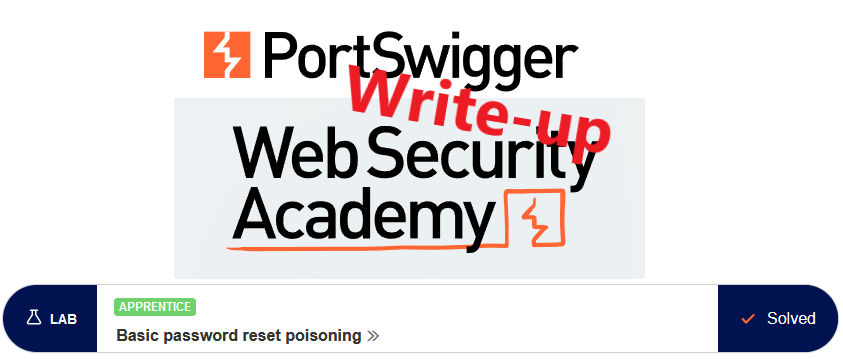
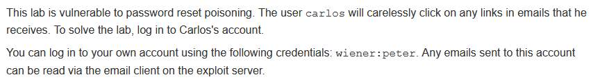
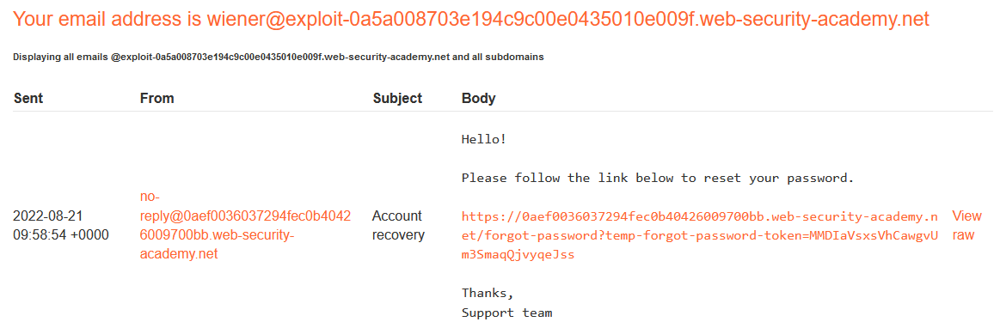
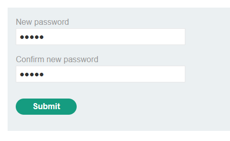
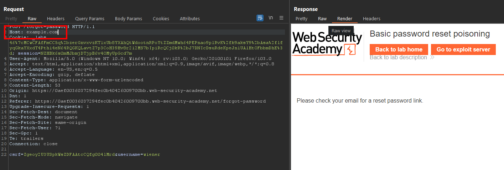
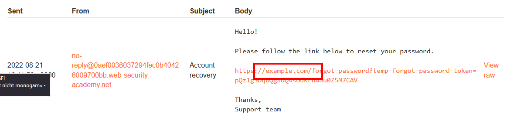
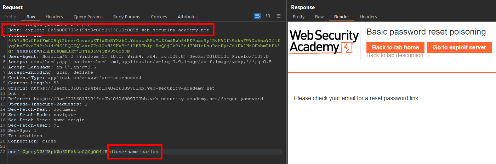
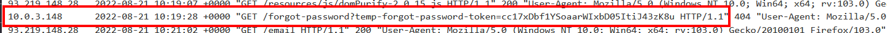
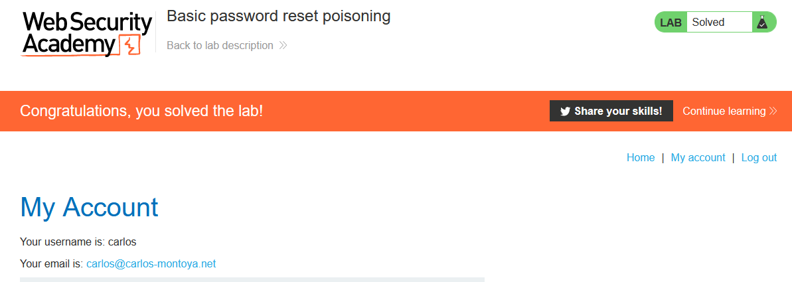

# Write-up: Basic password reset poisoning @ PortSwigger Academy

This write-up for the lab *Basic password reset poisoning* is part of my walk-through series for [PortSwigger's Web Security Academy](https://portswigger.net/web-security).

**Learning path**: Advanced topics → HTTP Host header attacks

Lab-Link: <https://portswigger.net/web-security/host-header/exploiting/password-reset-poisoning/lab-host-header-basic-password-reset-poisoning>  
Difficulty: APPRENTICE  
Python script: [script.py](script.py)  

## Lab description

## Steps

### Analysis

As usual, the first step is to analyze the functionality of the lab application. In this lab, it is a blog website.

The login form contains a `Forgot password?` functionality. I use it to request a pass reset for my user `wiener`.

This results in an email that is sent to my address, containing a reset link:

Once I click the link, I am presented with a form to set a new password:

I now go to the HTTP history of Burp to check the requests used for this functionality.

### The theory

The initial request to start the procedure contains my username as a parameter.

The link in the password reset email contains just a password token without any reference to the username. The token also changes with each request, so it is not something static. Furthermore, it is single-use.

That means that the backend ties this token to the username. While this is the best practice as it prevents client-side modification, it relies on the fact that the token does not fall into the wrong hands.

The link contains the URL of the lab application. In theory, this should be handled as a static constant in the backend and not rely on any input sent by the user.

### Modifying the request

Let's find out...

I load the request to initiate the password reset into Repeater and modify the `Host` header:

The password reset link contains a link to the domain specified in the `Host` header:

This means I am now at a point where:

- I can issue a password reset for any user
- Their confirmation link contains a reset link to an arbitrary domain specified by me
- The reset token itself ties to the username

https://0aef0036037294fec0b40426009700bb.web-security-academy.net/forgot-password?temp-forgot-password-token=cc17xDbf1YSoaarWIxbD05ItiJ43zK8u 

### The malicious payload

I send a request to reset the password for user `carlos`. The `Host` header I modify to point to my exploit server:

True to the description of his behavior, `carlos` clicks on the link and visits my server. His reset token is leaked into the access log of my server:

Now I use this token with the correct URL to set a new password for `carlos`. Once I log in with this new password, the lab updates to:

