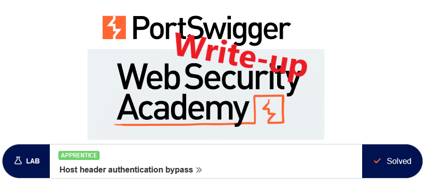
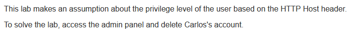
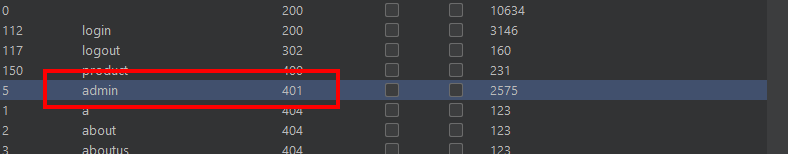
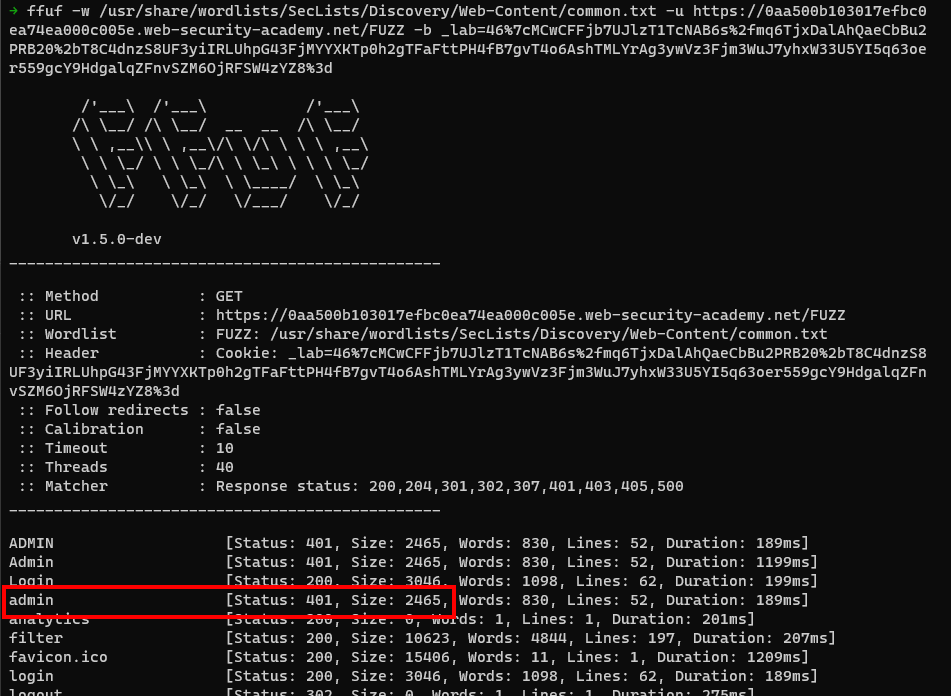
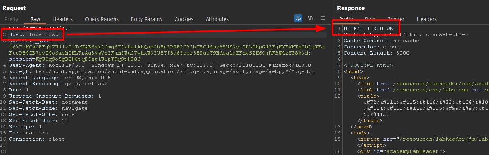

# Write-up: Host header authentication bypass @ PortSwigger Academy

This write-up for the lab *Host header authentication bypass* is part of my walk-through series for [PortSwigger's Web Security Academy](https://portswigger.net/web-security).

**Learning path**: Advanced topics → HTTP Host header attacks

Lab-Link: <https://portswigger.net/web-security/host-header/exploiting/lab-host-header-authentication-bypass>  
Difficulty: APPRENTICE  
Python script: [script.py](script.py)  

## Lab description

## Steps

### Analysis

As usual, the first step is to analyze the functionality of the lab application. In this lab, it is a shop website.

The description states to access authenticated functionality. Unfortunately, no known good credentials are provided so I cannot analyze normal authenticated traffic.

A quick discovery, or a good guess, shows a protected page at `/admin` that I lack the access permissions to:

.

What is noteworthy here is that this only shows with a valid `_lab` cookie, so when using a fuzzer like `ffuf` it must be included in the requests:

### The theory

One way for a web application to take a guess where the visitor comes from is the `Host` header. Normal browsers always keep it in sync with the target of the connection, so it is not possible to send the request to one host but have another value in the host header.

If developers rely on this it may lead to vulnerabilities. If a page should only be available for local connections then the naive way would be to filter for `localhost` or `127.0.0.1` in the `Host` header, after all, requests for these targets can only come from the very same machine.

Fortunately for me, Burp is not a normal browser and happily allows separation between the request target and the `Host` header.

I send the request to `/admin` to Burp Repeater and try some alterations for localhost. 

Sure enough, when using `localhost` as `Host` header, the request succeeds:

### The malicious payload

To improve the usability I add a rule to always replace the host header with localhost in the proxy options:

success

