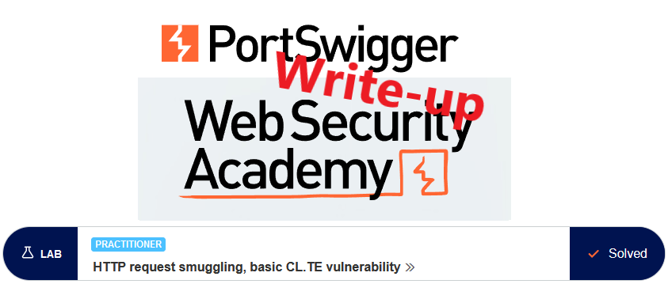
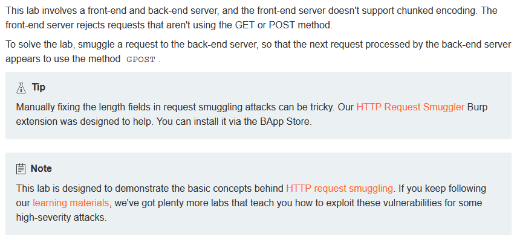
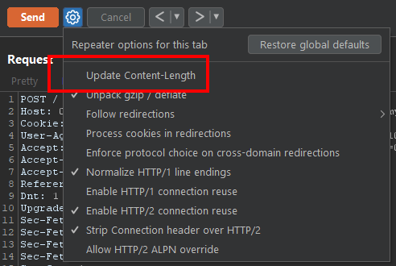
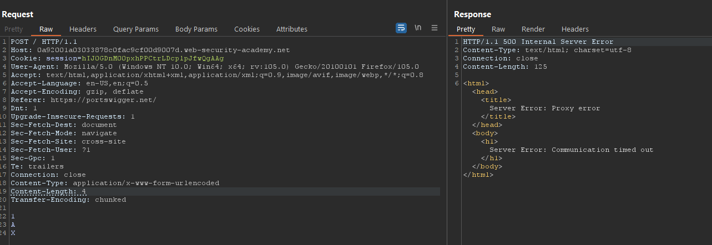
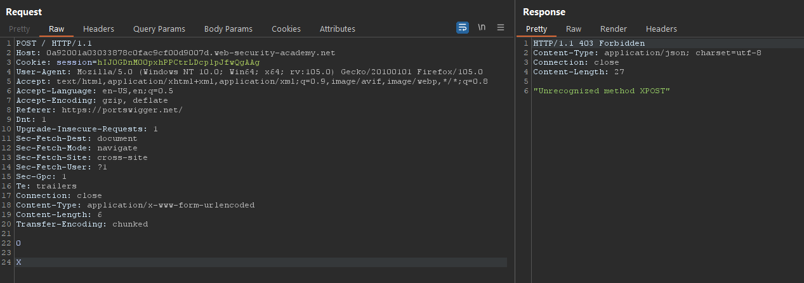
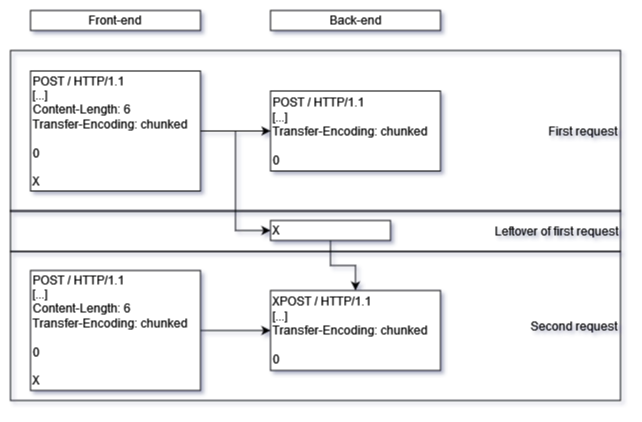
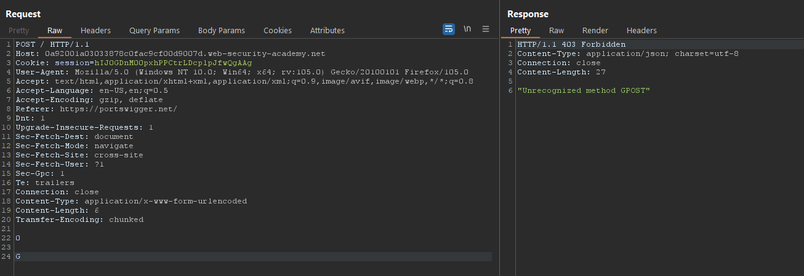
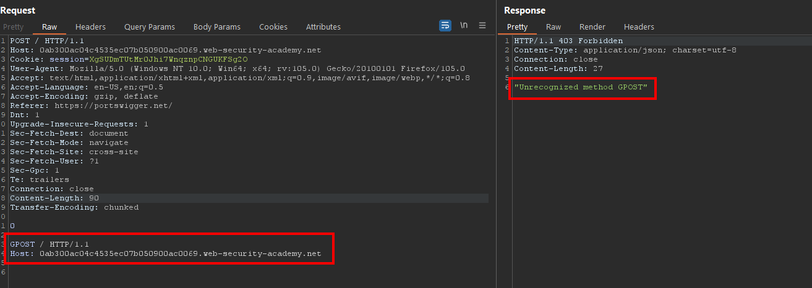

# Write-up: HTTP request smuggling, basic CL.TE vulnerability @ PortSwigger Academy

This write-up for the lab *HTTP request smuggling, basic CL.TE vulnerability* is part of my walk-through series for [PortSwigger's Web Security Academy](https://portswigger.net/web-security).

**Learning path**: Advanced topics → HTTP request smuggling

Lab-Link: <https://portswigger.net/web-security/request-smuggling/lab-basic-cl-te>  
Difficulty: PRACTITIONER  
Currently no python script

## Lab description

## Steps

Usually, the first step is to analyze the functionality of the lab application, which is a blog application. In this case, however, the vulnerability lies in the server itself.

---

### The theory

According to the lab description, the lab contains multiple servers that disagree on how HTTP requests are parsed.

While the front-end server only allows `GET` and `POST` requests, the back-end server supports a custom `GPOST` verb.

The first attempt is to find out whether the two servers agree on the interpretation of the headers `Content-Length` and `Transfer-Encoding`. By definition, the `Transfer-Encoding` shall take precedence if both headers are present.

If I can craft a request that the front-end server interprets as two different requests, then it will send two different requests to the back-end server.

---

### Trying things out

I send one of the requests to Burp Repeater. A `GET` request can not contain body data, so I change the verb to `POST`.

The first test is to check whether the front-end server uses `Content-Length` while the back-end server uses `Transfer-Encoding`.

For this, I need to prevent Burp to update the `Content-Length` header automatically for me:

I can now craft a request that contains inconsistent information. If the servers are vulnerable to this type of attack, then the front-end server will terminate the request after the `A` based on the value of `Content-Length`.

After the back-end server receives the request, it will wait for additional chunks, causing a delay. Sure enough, I receive a timeout after sending the request:

In this test, the front-end server cut a message short while the back-end server waited for the remaining content.

I can reverse this by causing the front-end server to send more content than the back-end server expects. The additional characters will then be prepended to the next request.

For the next request, I reactivate the automatic recalculation of `Content-Length`. I need to send the request twice, the first will result in the normal response while the second might reveal what the back-end server ends up receiving:

The second response proves that the `X` that was embedded in the first request got prepended to the second request, forming an invalid `XPOST` request:

---

### The malicious payload

Now I know that I can send requests that result in arbitrary characters added to the beginning of the next request. For this lab, I need to send a `GPOST` request so I have to perform just a minor alteration to my test request. Again, I have to send the request twice:

At that moment, the lab updates to  

---

### Another way

I can also smuggle a complete second request. In the body, I terminate the message with a zero-length chunk as above and follow up with a `GPOST` request. After sending it twice, I receive the `GPOST` method error again:

