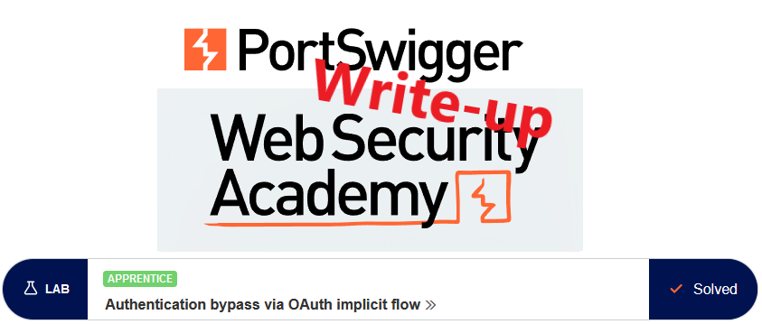
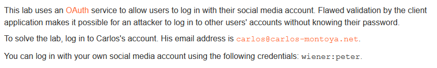
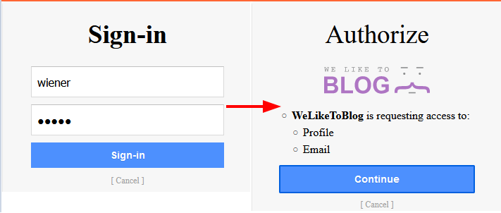
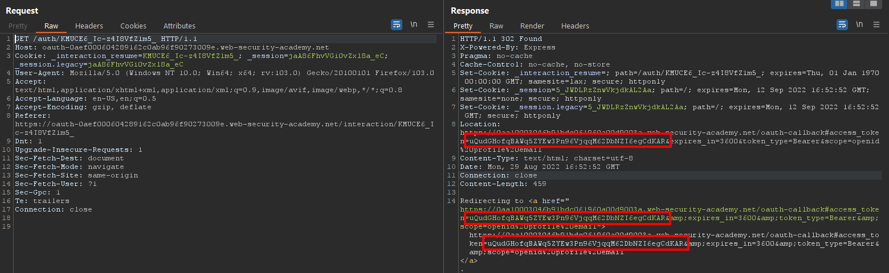
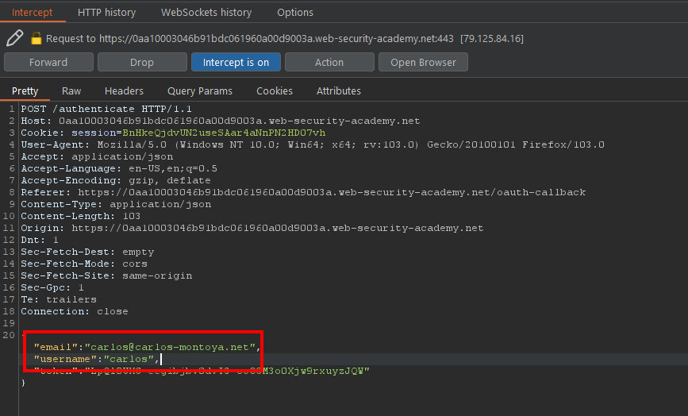
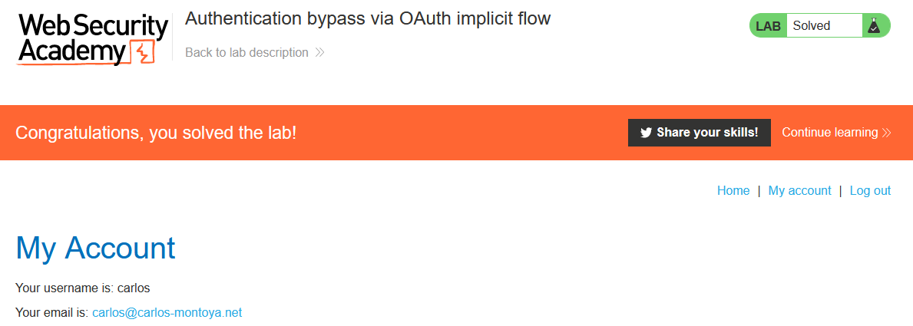

# Write-up: Authentication bypass via OAuth implicit flow @ PortSwigger Academy

This write-up for the lab *Authentication bypass via OAuth implicit flow* is part of my walk-through series for [PortSwigger's Web Security Academy](https://portswigger.net/web-security).

**Learning path**: Advanced topics → OAuth authentication

Lab-Link: <https://portswigger.net/web-security/oauth/lab-oauth-authentication-bypass-via-oauth-implicit-flow>  
Difficulty: APPRENTICE  
Python script: [script.py](script.py)  

## Lab description

## Steps

### Analysis

As usual, the first step is to analyze the functionality of the lab application. In this lab, it is a blog system.

The description mentions a flaw in the access control for authenticated functionality, so I log in with the known credentials of `wiener`. 

The login is done via an external identity provider. As a first step I log in, and in a second step I authorize the target application to receive some of my data:

Once I click on `Continue`, I am logged in to the lab application.

---

### The theory

After I log in, I check the request/response activities of the login feature in the history of Burp Proxy. 

The lab name already hints at the implicit flow of OAuth. This approach is insecure as it routes security information via the client, allowing me to manipulate it if no countermeasures against manipulation are included.

The identity provider sends me the authentication token which my client uses to authenticate towards the target application:

If no information about my username is encoded into the token, then using my token and replacing the username and email will be enough to impersonate my victim.

Even in the [original RFC](https://datatracker.ietf.org/doc/html/rfc6749#section-1.3.2) for OAuth 2.0, the security issue is mentioned. Unfortunately, in a rather vague manner:

> convenience should be weighed against the security implications

This wording does not discourage enough, so in the [latest draft](https://datatracker.ietf.org/doc/html/draft-ietf-oauth-security-topics#section-2.1.2) it is worded stronger and more direct:

> In order to avoid these issues, clients SHOULD NOT use the implicit grant [...]

Only time will tell if this is enough...

---

### The malicious payload

I log out of the application, activate intercept in Burp Proxy and re-login. Once the authentication token is intercepted, I change the username and email to my victim. 

That way, the token value of my login gets used for the account of my victim, at least if the token does not contain any information about username and/or email:

I forward the request and switch intercept off. Once all redirects are done, the application updates to

