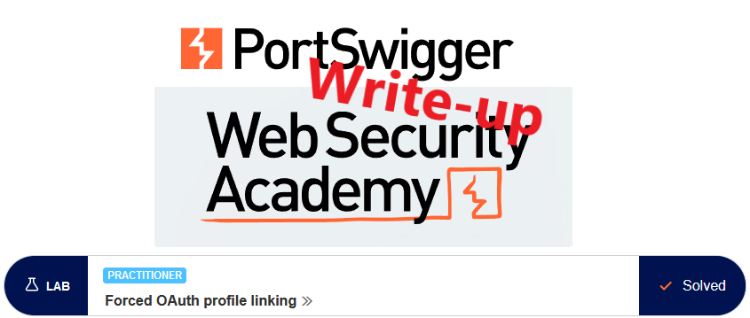
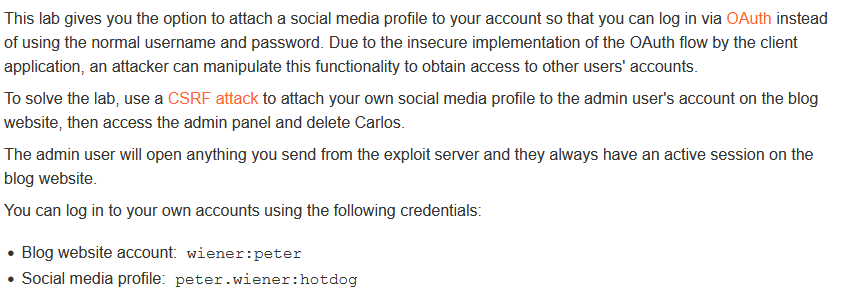
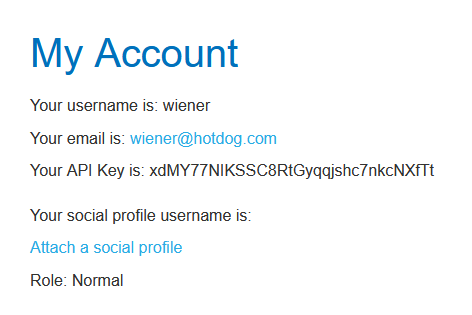
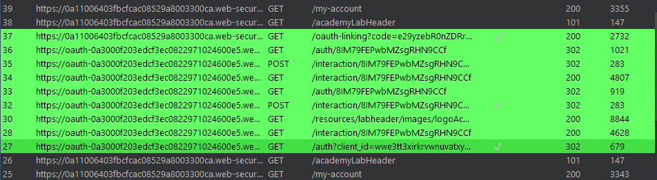
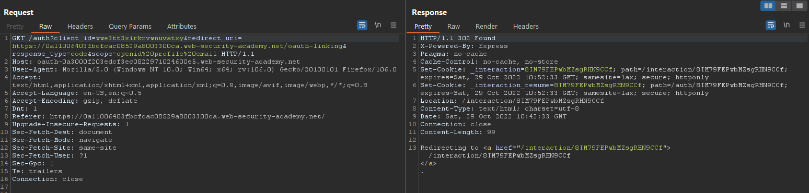
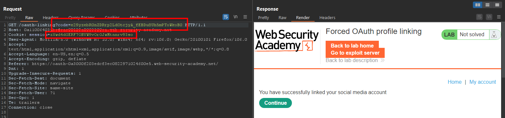
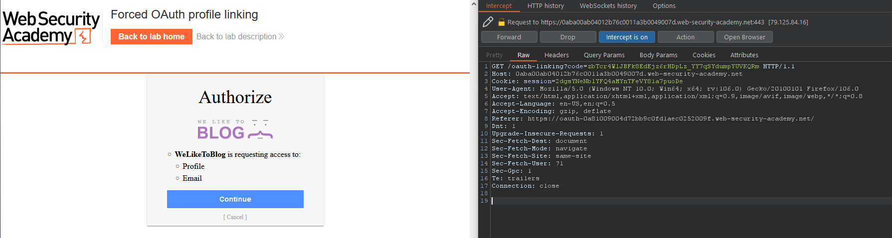
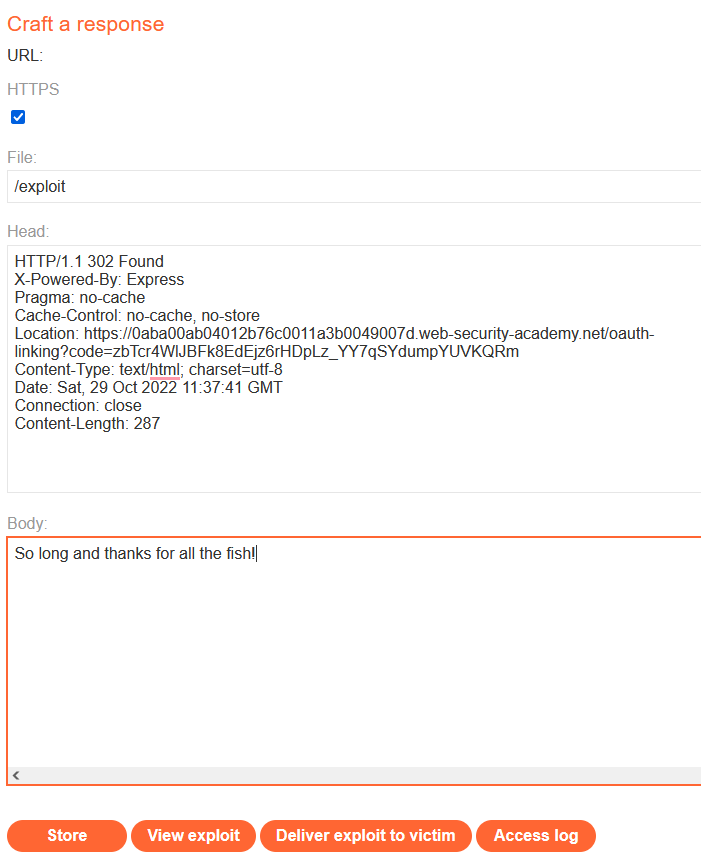
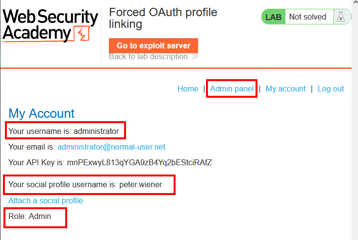
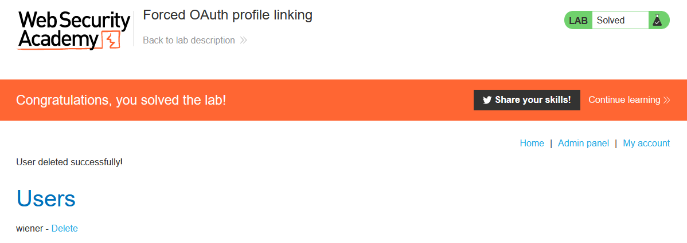

# Write-up: Forced OAuth profile linking @ PortSwigger Academy

This write-up for the lab *Forced OAuth profile linking* is part of my walk-through series for [PortSwigger's Web Security Academy](https://portswigger.net/web-security).

**Learning path**: Advanced topics → OAuth authentication

Lab-Link: <https://portswigger.net/web-security/oauth/lab-oauth-forced-oauth-profile-linking>  
Difficulty: PRACTITIONER  
Python script: [script.py](script.py)  

## Lab description

## Steps

### Analysis

As usual, the first step is to analyze the functionality of the lab application. In this lab, it is a blog system. I also have access to an exploit server that can host a web page that I can send to my victim.

The application allows me to link a social media profile to my account. Afterward, I can use it to log in with that instead of my credentials.

So I do just that to analyze the traffic that is involved by linking the accounts:

What is noteworthy about this request is that it does not appear to contain any identifier by which the application is later able to verify that the response received by the oauth provider was triggered by the user that is logged in then.

Sure enough, once all the requests between my browser and the OAuth provider are done, the request to the OAuth client (the blog application) contains a code provided by the OAuth provider as well as my session cookie.

### The theory

I now know that the linking between my application login and the OAuth provider is done on the last redirect of the linking process. 

Based on the request history I assume that the OAuth access is linked to the account that is logged in at the time of this latter request.

I assume that I can initiate the OAuth linking from my own account but drop the final request back to the application. I then create a page on the exploit server that contains this final redirect and send it to the victim.

My OAuth account should then be linked to the administrator account of the application.

### The malicious payload

As my OAuth account is already linked to the account of `wiener`, I wait for the timeout of the lab application to continue.

initiate the attack by starting to link my OAuth account. I then drop the final request back to the application:

That request was caused by a redirect from the OAuth provider back to the application. I go to the HTTP history, copy the response and paste it as a page on my exploit server.

The important part is the `Location` header that initiates the redirect, so I some of the clutter, especially the cookies:

I send the exploit to the victim and hope that the administrator checks that page.

To find out if I was successful, I log out of the application and login with the OAuth provider.

Luckily, the administrator obeys the lab description and checks all pages. My account page now shows that my social media account is linked to the administrator account on the blog application:

Once I access the admin panel and delete user `carlos`, the lab updates to 

