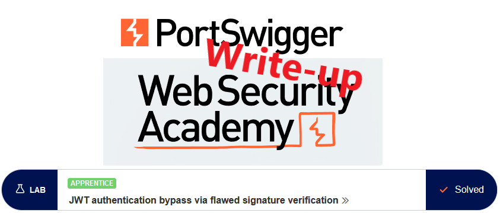
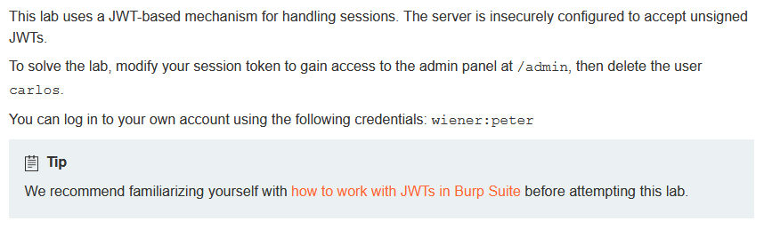
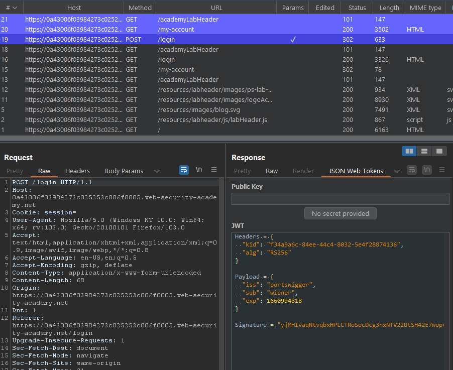
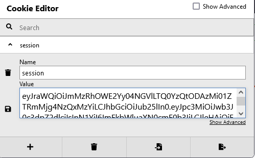
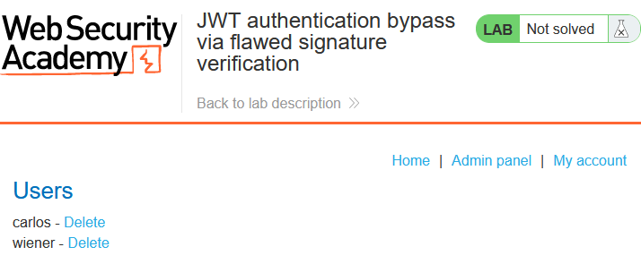
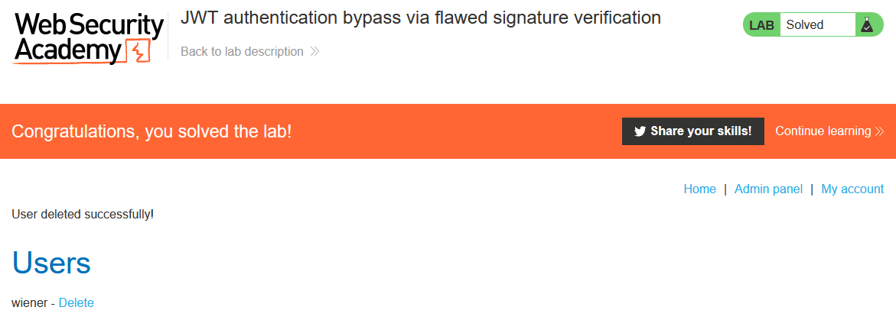

# Write-up: JWT authentication bypass via flawed signature verification @ PortSwigger Academy

This write-up for the lab *JWT authentication bypass via flawed signature verification* is part of my walk-through series for [PortSwigger's Web Security Academy](https://portswigger.net/web-security).

**Learning path**: Advanced topics → JWT attacks

Lab-Link: <https://portswigger.net/web-security/jwt/lab-jwt-authentication-bypass-via-flawed-signature-verification>  
Difficulty: APPRENTICE  
Python script: [script.py](script.py)  

## Lab description

## Steps

The lab application deals with JWTs. I use the extension `JSON Web Tokens (JWT4B)` to avoid having to deal with manual de- and encoding of the JWTs all the time.

### Analysis

As usual, the first step is to analyze the functionality of the lab application. In this lab, it is a blog page.

The lab description refers to authenticated functionality, so I log in with the credentials of `wiener`. Right away, Burp Proxy notifies me that the response contains a JWT:

When I try to access the `/admin` page as user `wiener`, I am greeted by the message `Admin interface only available if logged in as an administrator`.

### The theory

The JWT does not show anything out of the extraordinary here:

- The payload contains my username.
- The token is protected by an RS256 signature.

As I do not have the private key, I can not create a valid signature if I manipulate this token. 

However, there are two questions that could point to severe vulnerabilities:

- Does the website trust the algorithm specified in the token?
- Does the website verify the signature?

Any one of these vulnerabilities will allow me to create arbitrary valid tokens. As it is trivial to answer these questions, it is the first thing to test.

### Check the null algorithm

One possible algorithm for the signature of JWTs is the `null` algorithm. It basically states that the token comes from a trusted source and does not require signature verification.

This can be a security issue when dealing with untrusted client input. A web application must always enforce the algorithm during the verification of such input and ignore the algorithm provided in the token.

To test it, I send the request to the `/my-account` page to Burp Repeater and change the algorithm to `none`. In the JWT, the signature component is left empty.

The response to this request results in my normal account page. This confirms that the backend trusts and uses the algorithm provided in the token to provide access to authenticated content.

### The malicious requests

To abuse this, I modify the cookie in my browser. I change my username to `administrator`, the algorithm to 'none', encode the first two parts again and remove the signature part.

Now I reload the account page and go to the `Admin panel`:

After I click the link to delete user `carlos`, the lab updates to

