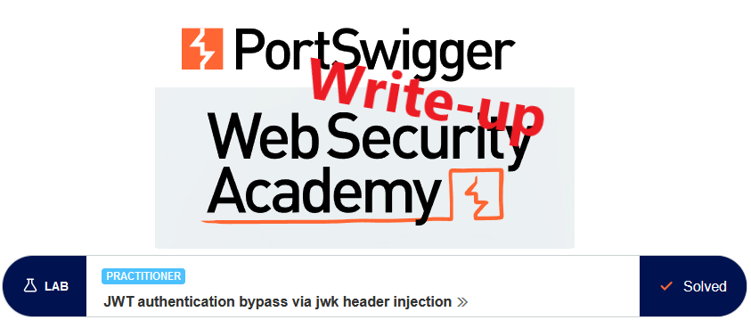
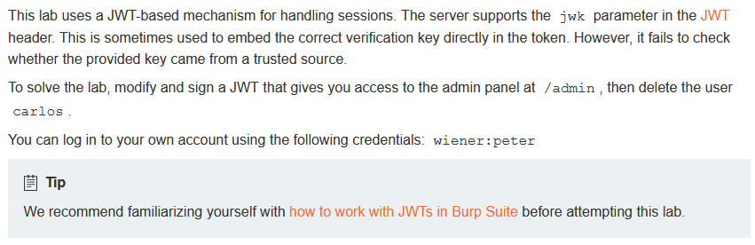
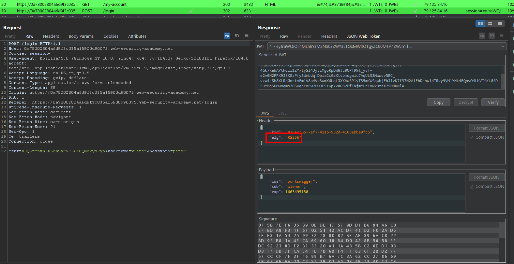
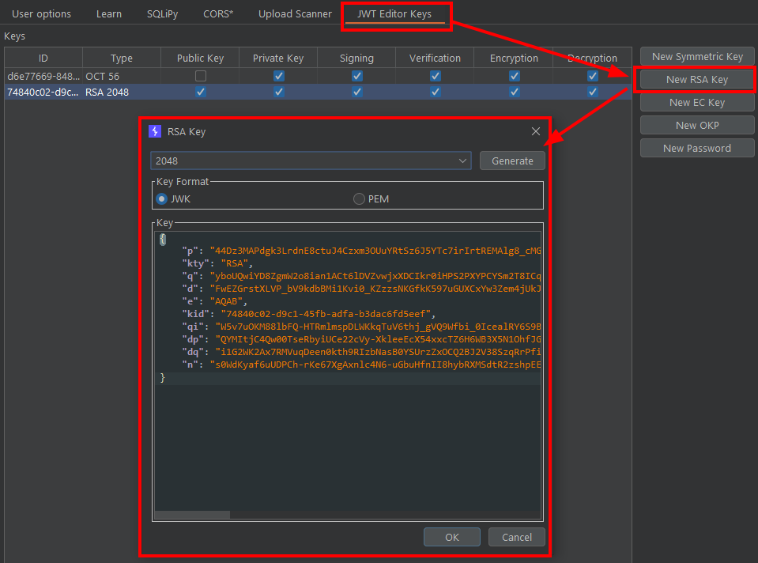
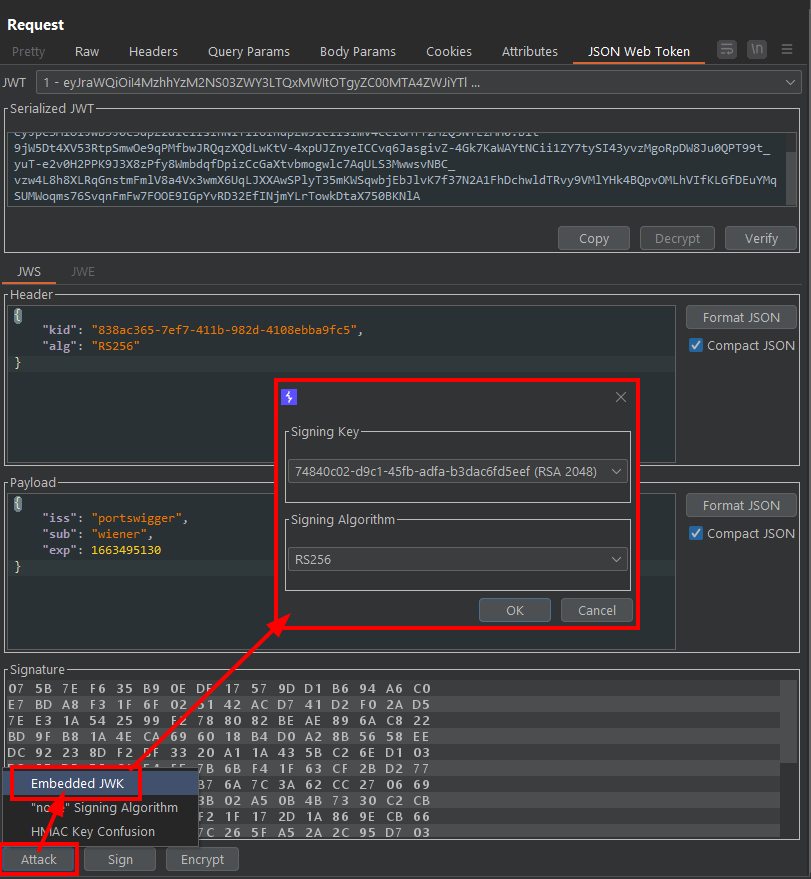
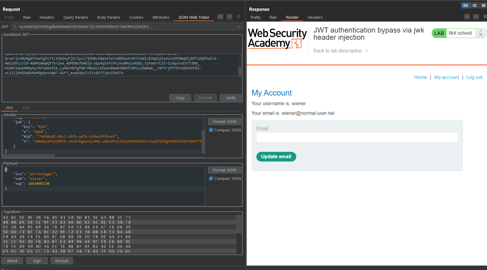
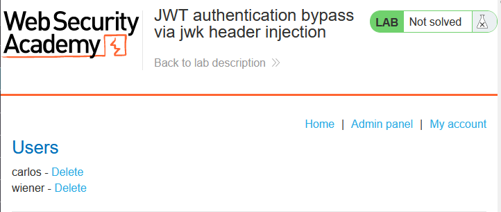
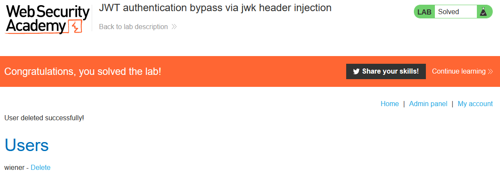

# Write-up: JWT authentication bypass via jwk header injection @ PortSwigger Academy

This write-up for the lab *JWT authentication bypass via jwk header injection* is part of my walk-through series for [PortSwigger's Web Security Academy](https://portswigger.net/web-security).

**Learning path**: Advanced topics → JWT attacks

Lab-Link: <https://portswigger.net/web-security/jwt/lab-jwt-authentication-bypass-via-jwk-header-injection>  
Difficulty: PRACTITIONER  
Python script: [script.py](script.py)  

## Lab description

## Steps

### Analysis

As usual, the first step is to analyze the functionality of the lab application. In this lab, it is a blog platform. To help with this lab I use the extension *JWT Editor* (to be found in the *BApp Store* or as a standalone version on [github](https://github.com/portswigger/jwt-editor))

The lab is about authenticated functionality. I use the credentials provided and log in as `wiener`. Burp identifies the session cookie as JWT and decodes it straight away:

### The theory

The server uses `RS256` as the algorithm for the token. There are multiple options that I can follow

1. None algorithm / strip signature
2. Inject my own key
3. Obtain the private key (and password if it is protected)

The first option is the easiest to test. In theory, the next step would be to check whether I can remove the signature or change the algorithm to *none*. However, there are dedicated labs for these two issues so I skip the checks here. Refer to [JWT authentication bypass via flawed signature verification](../JWT_authentication_bypass_via_flawed_signature_verification/README.md) and [JWT authentication bypass via unverified signature](../JWT_authentication_bypass_via_unverified_signature/README.md) for details.

The second option has two flavors. I can either change the algorithm to HS256 and inject a secret key or I keep the algorithm and inject an RSA key. It is always best to change as little as possible, so trying to inject an RSA key changes only one variable. I also do not know whether the backend uses the algorithm provided in the token or enforces RS256.

Option (3) is unlikely and also the most difficult, so I skip this for now until everything else fails.

I now generate a new *RSA key* in the *JWT Editor key store*:

In the Burp Proxy, I send the request to `/my-account` to Repeater and select the `Attack -> Embedd JWK` option. I select the RSA signing key I just generated:

After clicking `OK`, the signature is updated automatically. If the request contains an invalid or no JWT as the session cookie, the application redirects to the `/login` page. 

I send the request and the response contains my account page, confirming that the signature verification on the backend used the RSA public key information I injected in the JWT header.

### The malicious payload

I change the `sub` value of the token to `administrator`, perform the `Attack -> Embedd JWK` option again, copy the serialized JWT and update my session cookie in the browser (for manipulating the cookie, I use the [Cookie-Editor](https://cookie-editor.cgagnier.ca/)):

Now I refresh the `/admin` page. Instead of the error `Admin interface only available if logged in as an administrator`, I am greeted with the user management page:

After clicking on the `Delete` link for user `carlos`, the lab updates to

