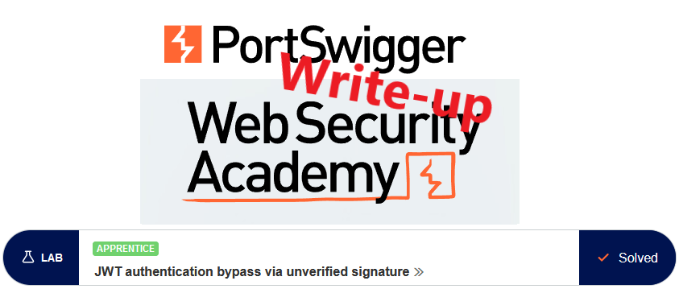
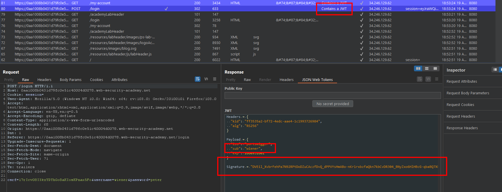
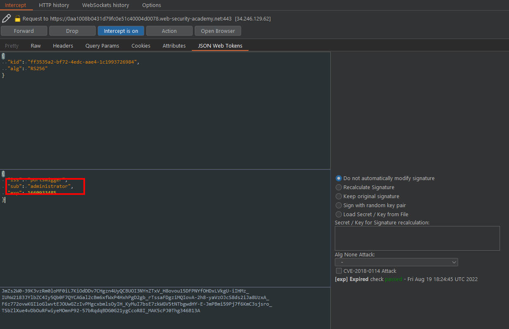
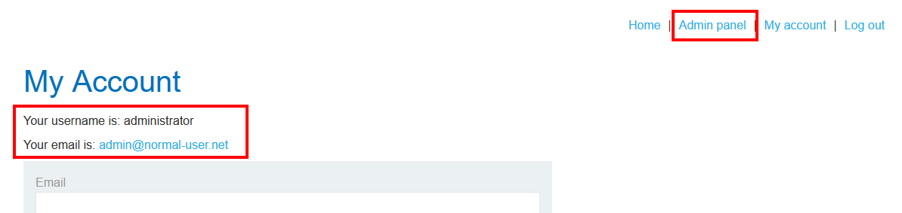
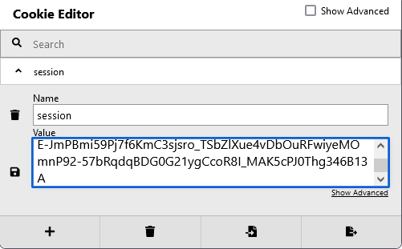
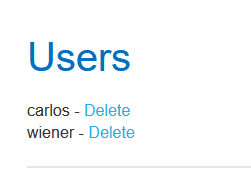

# Write-up: JWT authentication bypass via unverified signature @ PortSwigger Academy

This write-up for the lab *JWT authentication bypass via unverified signature* is part of my walk-through series for [PortSwigger's Web Security Academy](https://portswigger.net/web-security).

**Learning path**: Advanced topics → JWT attacks

Lab-Link: <https://portswigger.net/web-security/jwt/lab-jwt-authentication-bypass-via-unverified-signature>  
Difficulty: APPRENTICE  
Python script: [script.py](script.py)  

## Lab description

## Steps

As the lab application deals with JWTs, I use the extension `JSON Web Tokens (JWT4B)` to avoid having to deal with manual de- and encoding of the JWTs all the time.

### Analysis

As usual, the first step is to analyze the functionality of the lab application. In this lab, it is a blog page.

The lab description refers to authenticated functionality, so I log in with the credentials of `wiener`. Right away, Burp Proxy notifies me that the response contains a JWT:

When I try to access the `/admin` page as user `wiener`, I am greeted by the message `Admin interface only available if logged in as an administrator`.

---

### The theory

The JWT does not show anything out of the extraordinary here:

- The payload contains my username.
- The token is protected by an RS256 signature.

As I do not have the private key, I can not create a valid signature if I manipulate this token. 

However, there are two questions that could point to severe vulnerabilities:

- Does the website verify the signature?
- Does the website trust the algorithm specified in the token?

Any one of these vulnerabilities will allow me to create arbitrary valid tokens. As it is trivial to answer these questions, it is the first thing to test.

---

### Check if the signature is verified

To find out whether the server verifies the signature, I reload the `/my-account` page and intercept the request with Burp Proxy.

In the JWT payload, I change my user claim to be `administrator`. While I don't know whether this account name exists, it is a good first try.

This I have to do a few times, then I'm greeted by the account page of `administrator`:

---

### Be the malicious actor

I don't want to change the user claim manually for all requests, so I copy the modified cookie value from the request and replace the cookie in my browser:

An alternative would be to use Burp "Match and Replace" functionality to replace the cookie, or even the specific claim, on the fly for all requests. However, just changing the cookie in the browser is much simpler.

Then I click on the `Admin panel` link and am presented with the user management page:

After I click the link to delete user `carlos`, the lab updates to

