# Write-up: JWT authentication bypass via weak signing key @ PortSwigger Academy

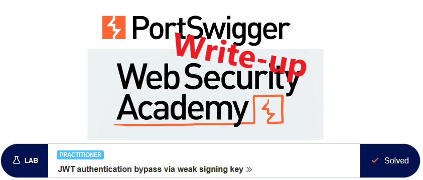

This write-up for the lab *JWT authentication bypass via weak signing key* is part of my walk-through series for [PortSwigger's Web Security Academy](https://portswigger.net/web-security).

**Learning path**: Advanced topics → JWT attacks

Lab-Link: <https://portswigger.net/web-security/jwt/lab-jwt-authentication-bypass-via-weak-signing-key>  
Difficulty: PRACTITIONER  
Python script: [script.py](script.py)  

## Lab description

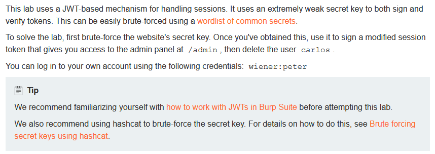

## Steps

### Analysis

As usual, the first step is to analyze the functionality of the lab application. In this lab, it is a blog system.

I log in with the credentials provided for the user `wiener` to analyze the JWT that is used by the application. In Burp I use the extension *JWT Editor*, which directly identifies and decodes the token:

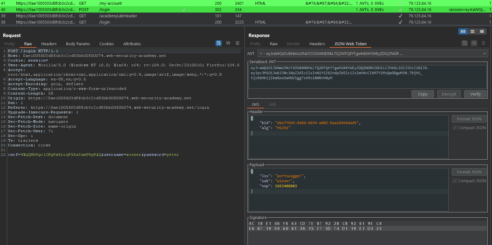

In theory, the next step would be to check whether I can remove the signature or change the algorithm to *none*. However, there are dedicated labs for these two issues so I skip the checks here. Refer to [JWT authentication bypass via flawed signature verification](../JWT_authentication_bypass_via_flawed_signature_verification/README.md) and [JWT authentication bypass via unverified signature](../JWT_authentication_bypass_via_unverified_signature/README.md) for details.

### The theory

I store the JWT from the response in a file:

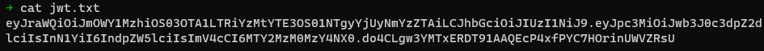

The JWT uses `HS256` as the algorithm so I just need the secret key to create arbitrary signed tokens myself. Fortunately, hashcat comes with an attack mode for JWTs out of the box, so I can use this file straight away:

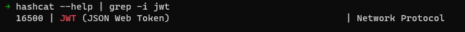

I also download the referenced [wordlist of common secrets](https://github.com/wallarm/jwt-secrets/blob/master/jwt.secrets.list) and start the hashcat run with:

```
hashcat -a 0 -m 16500 jwt.txt jwt.secrets.list
```

After a short time, hashcat is successful in finding the correct key:

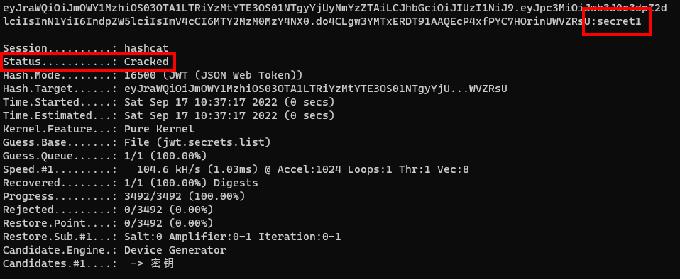

### The malicious payload

With the signature key known, I can create my own arbitrary tokens. I store the key in the key store of the `JWT Editor`. It needs to be base64-encoded which can be done in Burp decoder or on the command line with `echo -n 'secret1' | base64`:

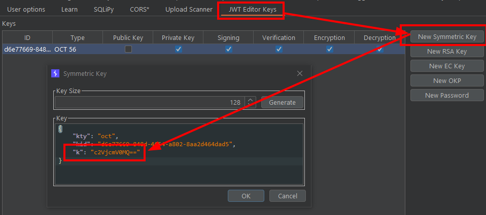

I request the `/admin` page with my normal user account and receive the expected `Admin interface only available if logged in as an administrator` message. This request I send to Burp Repeater.

The payload only contains the username and no privileges or roles. So as a first attempt I try to use `administrator` as my username. In the payload, I change the `sub` value to `administrator` and re-sign the token with the signing key that I stored above.

The result looks promising:

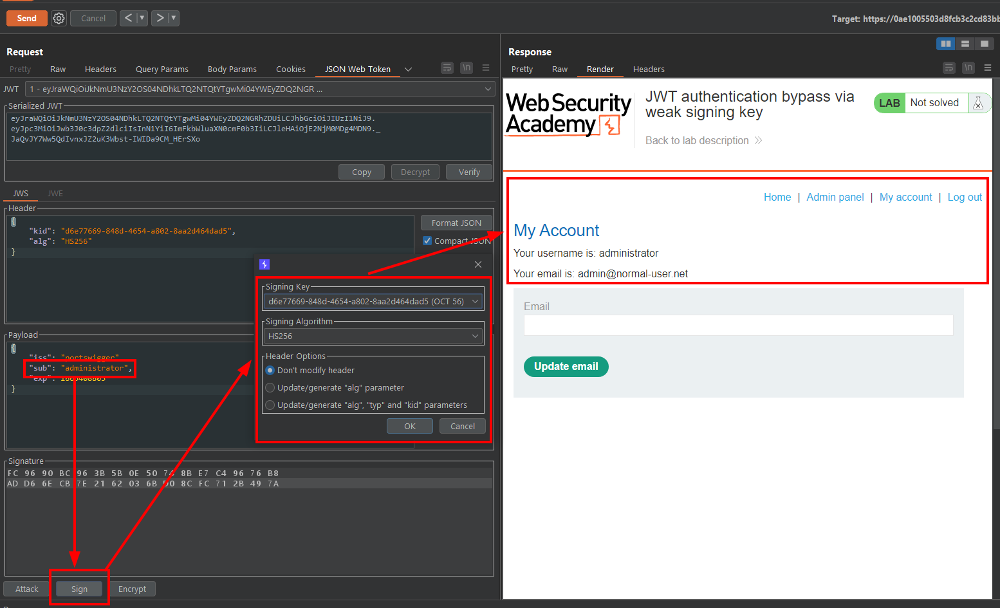

Now that I know that the JWT is correct for `administrator`, I replace my session cookie with this manipulated token. That way, I do not need to modify requests but can work directly in the browser.

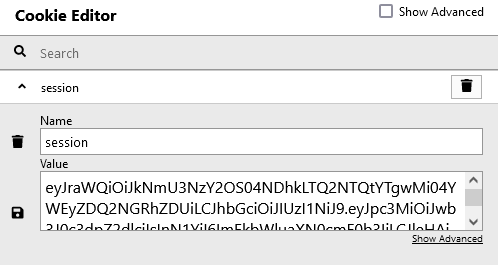

I reload the `/admin` page in the browser. Instead of the earlier error message, I am greeted with the user management:

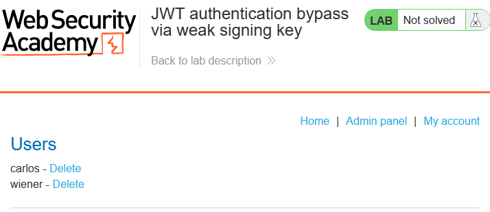

After clicking on the `Delete` link for user `carlos`, the lab updates to

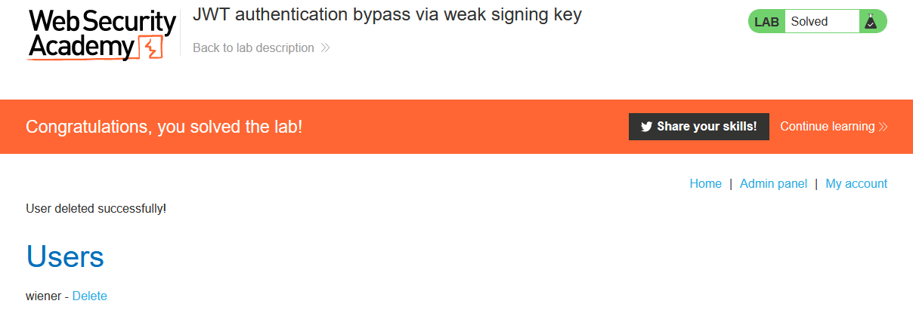
