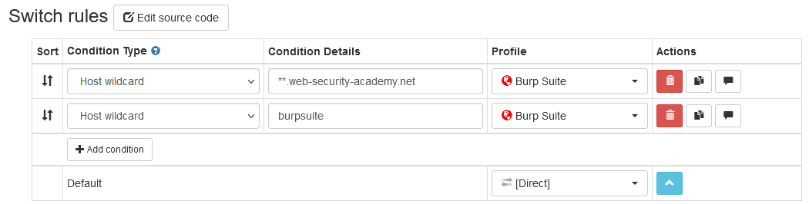

# Writeup PortSwigger WebSecurity Academy

This repo contains my writeups and scripts for solving the [PortSwigger WebSecurity Academy](https://portswigger.net/web-security). I plan to follow the learning path provided by PortSwigger, however I expect to skip some of the expert level labs initially.

## Goal

My ultimate goal is to obtain a level of expertise in the matter at hand to be able to pass the [Burp Suite Certified Practitioner](https://portswigger.net/web-security/certification) examination. As such, I not only want to solve the labs, but also understand why the solution works.

The scripts are there to help me obtain some routine of creating such script files. Such a skill may not be that important to solve individual labs or the exam itself. But in real life scenarios the ability to quickly create proof-of-concepts for vulnerabilities is helpful. 

So I create the scripts to learn about python and how to use it to interact with websites. Can these scripts be used to cheat the progress in the labs? Yes, but you only cheat yourself.

## Status

| ID | Topic | | Status |
| --- | --- | :---: | :---: |
|    | **Server-side topics** ||
| 01 | SQL inection | :heavy_check_mark: | 16/16 |
| 02 | Authentication | :heavy_check_mark: | 14/14 |
| 03 | Directory traversal | :heavy_check_mark: | 6/6 |
| 04 | Command inection | :heavy_check_mark: | 5/5 |
| 05 | Business logic vulnerabilities | | 10/11 |
| 06 | Information disclosure | :heavy_check_mark: | 5/5 |
| 07 | Access control | :heavy_check_mark: | 13/13 |
| 08 | File upload vulnerabilities | | 6/7 |
| 09 | Server-side request forgery (SSRF) | :heavy_check_mark: | 7/7 |
| 10 | XXE injection | :heavy_check_mark: | 9/9 |
|    | **Client-side topics** ||
| 11 | Cross-site scripting (XSS) || 21/30 |
| 12 | Cross-site request forgery (CSRF) | :heavy_check_mark: | 8/8 |
| 13 | Cross-origin resource sharing (CORS) || 2/4 |
| 14 | Clickacking || 0/5 |
| 15 | DOM-based vulnerabilities || 0/7 |
| 16 | WebSockets || 0/3 |
|    | **Advanced topics** || 
| 17 | Insecure deserialization || 0/10 |
| 18 | Server-side template injection || 0/7 |
| 19 | Web cache poisoning || 0/13 |
| 20 | HTTP Host header attacks || 0/6 |
| 21 | HTTP request smuggling || 0/12 |
| 22 | OAuth authentication || 0/6 |

## Tooling

For the most part, I try to stick with using Burp Suite Pro and a browser only. I recommend using a cookie editor in the browser as well as a quick switch to using Burp Proxy.

Personally, I use [Cookie-Editor](https://cookie-editor.cgagnier.ca/) for manipulating cookies as well as [Proxy SwitchyOmega](https://github.com/FelisCatus/SwitchyOmega) to quickly (or even automatically) switch to Burp Proxy.

If you like to have the switching to proxy automated, you can setup a switch profile like this:

This way, all lab traffic automatically goes to Burp, while all other traffic gets the direct connection.

## Ressources

PortSwigger has very nice learning resources on their website. Basically, everything required to get started is there.

For a nice video series I can recommend the video series of [Rana Khalil](https://www.youtube.com/c/RanaKhalil101/playlists) on youtube. At the current time, she uploaded videos that cover SQL Injection and CSRF, but she shows everything she does and explains very nicely. And she uploads a new lab video each week (roughly), so I'm sure over time she will cover the full content of the WebSecurity Academy.
