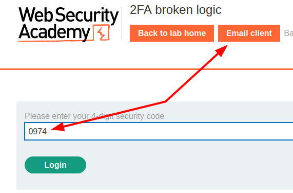
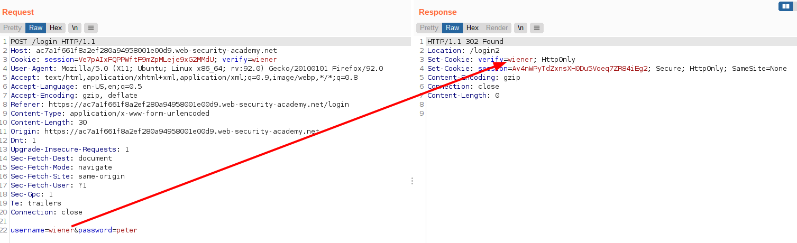
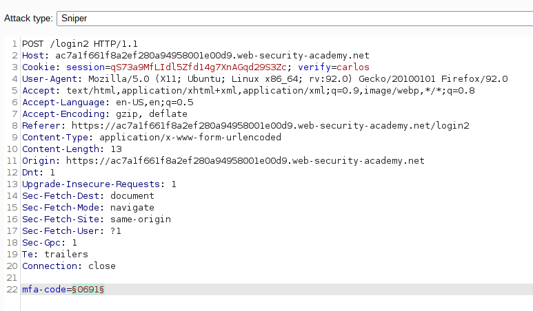
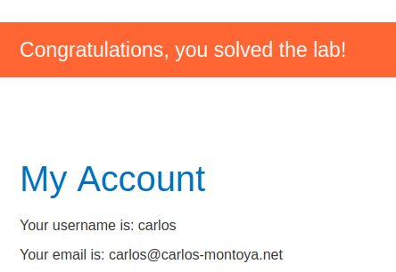

# Lab: 2FA broken logic

Lab-Link: <https://portswigger.net/web-security/authentication/multi-factor/lab-2fa-broken-logic>  
Difficulty: PRACTITIONER  
Python script: [script.py](script.py)  

## Known information

- 2FA authentication is used, having flawed logic
- Credentials given for user `wiener:peter` + access to his 2FA emails
- Goals:
  - Access account page of user `carlos`

## Steps

### Analyse successful login process

We have access to a valid user account on that system, so login to see how the normal authentication flow looks like.

On the website everything looks as expected. Next step is to analyse the requests and responses in more details:

The first interesting thing is that the username provided in the POST request is reflected back as a cookie. In the request of the security code (`login2`), this cookie is included:

I wonder what happens if the cookie value gets replaced in the second step? In theory, it should not matter because everything should be combined into a session on the server side, never involving any client side storage of information for anything but the session ID.

### Modify cookies

Trying to repeat every request sent so far with just changing the `verify=wiener` to `verify=carlos` in the cookie did not result in anything useful yet. However, some of them might have triggered the setup of a 2FA code for `carlos`.

This lab allows to completely bypass the credentials check for the victim account, the only thing required is an own set of credentials and a valid username for the victim.

- Attack type: **Sniper**
- Payload: Numbers, 0-9999, Number format 4 digits

Now simply select `Request in browser` from the context menu to:

