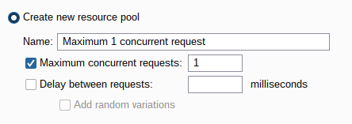
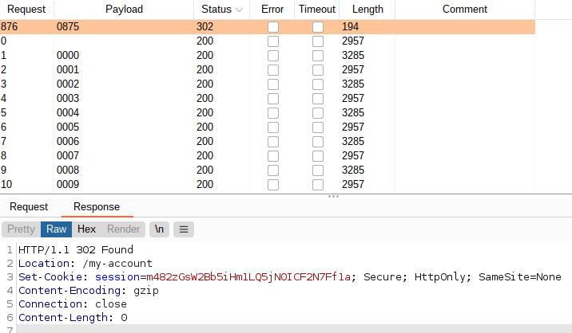

# Lab: 2FA bypass using a brute-force attack

Lab-Link: <https://portswigger.net/web-security/authentication/multi-factor/lab-2fa-bypass-using-a-brute-force-attack>  
Difficulty: EXPERT  
Python script: [script.py](script.py)  

## Known information

- 2FA authentication vulnerable to brute force
- valid user credentials known: `carlos:montoya`
- Goals:
  - Access account page of user `carlos`

## Steps

The hint for this lab indicates that Burp macros or extensions like Turbo Intruder are required. As I never used Burp macros before, I decided to go that way and follow the provided solution to learn.

### Analyse process flow

First thing is to analyse the login workflow

Verify that the last response asks for the MFA-code when running the macro:

Setup the session handling rules. Ensure the lab page is within the defined scope in the session handling rule editor.

Now it is time to start the brute force attack. Select the POST request with the MFA-code from the history, send it to Burp Intruder and select the MFA-code as payload.

- Attack type: **Sniper**
- Payload: Numbers, 0-9999, 4 digits

Also ensure that only a single concurrent request is used:

Show results in Browser nets a:

