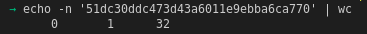
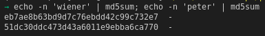
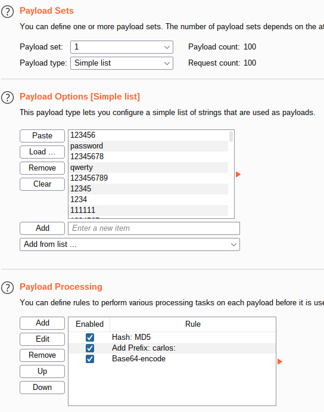

# Lab: Brute-forcing a stay-logged-in cookie

Lab-Link: <https://portswigger.net/web-security/authentication/other-mechanisms/lab-brute-forcing-a-stay-logged-in-cookie>  
Difficulty: PRACTITIONER  
Python script: [script.py](script.py)  

## Known information

- Website offers a 'stay logged in' feature utilizing cookies
- Cookie is vulnerable to brute force attacks
- Known credentials for a user `wiener:peter`
- Goals:
  - Access the account page of user `carlos`

## Steps

### Analyse cookie

As usual, the initial step is to analyse the login and 'stay-login' process. As such, I login with the known credentials of user `wiener`. In the response, a cookie is set that catches the eye:

Using Burp Suite, it immediately shows the decoded value in the Inspector:

It can be seen that the username is part of the cookie. If I can guess the second part it becomes possible to create valid cookies for any known user.

The second part looks like a hash and is 32 characters long, which lets me think md5. Lets see if it is a simple md5 of the username (which would be a really fatal flaw) or the password (which would be not much better):

### Brute force the cookie

Send the request of the account page to Burp Intruder, setting the `stay-logged-in` cookie as payload

- Attack type: **Sniper**
- Payload: 

I also set on the options page a matching rule to quickly see if I am logged in as user `carlos`:

And sure enough, ordering after this rule just has a single hit:

Requesting the page in the browser results in:

### Brute force the password

As the hash is not salted (does not contain any random part) it becomes easy to get the password with the help of rainbow tables. As the candidate password file is rather short, the password brute force can be done quickly without such tables:

And yes, I know that this approach is very bad in real life, as it calculates every single hash before it does the grep, but it was the fastest to type that came into mind :)
