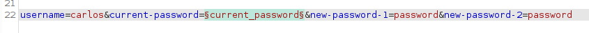
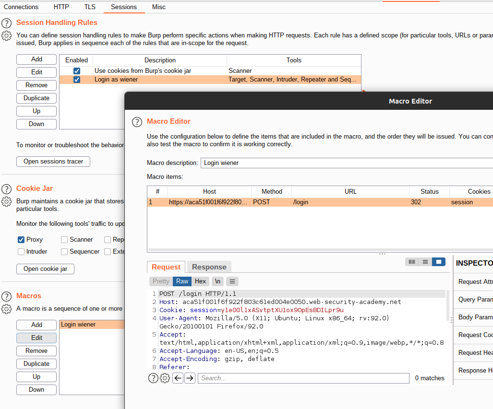
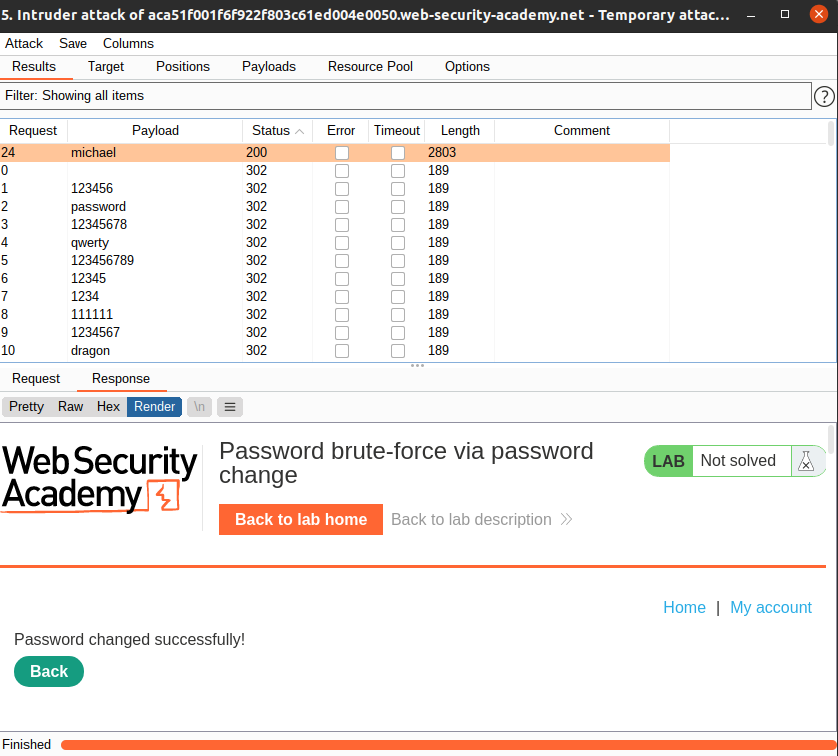

# Lab: Password brute-force via password change

Lab-Link: <https://portswigger.net/web-security/authentication/other-mechanisms/lab-password-brute-force-via-password-change>  
Difficulty: PRACTITIONER  
Python script: [script.py](script.py)  

## Known information

- Change password functionality vulnerable to brute force
- Known good user credentials `wiener:peter`
- Goals:
  - Brute force the password of user `carlos`
  - Access his account page

## Steps

### Analyse password change

As usual, the first step is to analyse the password change functionality with the known account. Login as `wiener` and change the password.

The form contains a hidden field for the username:

Ideally, the page should limit the password change to the session of the current user. But in this case the explicit inclusion of the username in the form would be pointless. Therefore I guess that the username is taken from the input provided.

### Brute force current password, naive attempt

So send the request to Burp Intruder:

- Attack type: **Sniper**
- Payload: List of candidate passwords

The response to all requests looks identical:

When I changed the password for my own account, the result was a `200 OK`. My first guess is that after the current password is wrong during the password change, the system invalidates the current session. Try it out by changing the password of `wiener`, but provide an incorrect current password. Sure enough, I receive a 302 to the login page and lost my session.

### Brute force current password, take 2

So before every password change attempt, login as wiener to provide a valid session and use it for one password guess.

Create a macro that repeats the login and use it as session rule. Ensure that the scope definition is correct of the session handling rule (e.g. by using `Include all URLs`)

Repeat the naive attempt. This time, the result is very much different:

What is left is logging in with `carlos:password` to get:

Of course, next time the real `carlos` wants to login, he will notice that his password does not work. In the best case scenario he'll just assume he forgot it and uses the `forgotten password` feature without thinking much about it. But it is very possible that he suspects foul play and catches something fishy is going on (which is bad for us as attacker).

So a much more subtle approach is to set the old password as the new password. This lowers the chance that the user notices this.

### An unexpected twist

While writing the script for this lab, I encountered a nice twist.

Brute forcing the password and changing it worked as expected, I got the `Password changed successfully!` message. But when I tried to login afterwards to verify that the lab is solved, I encountered the error `You have made too many incorrect login attempts. Please try again in 1 minute(s).`. Obviously, the invalid password guess attempts to change the password count for the brute force check during login. My manual solution was slow enough to not notice it, but python tries to verify too fast.

Nicely played, thank you!
