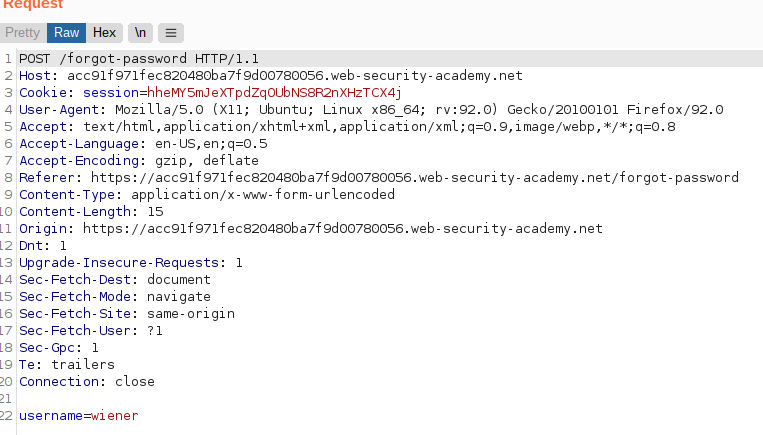

# Lab: Password reset broken logic

Lab-Link: <https://portswigger.net/web-security/authentication/other-mechanisms/lab-password-reset-broken-logic>  
Difficulty: APPRENTICE  
Python script: Currently no script

## Known information

- Vulnerable password reset functionality
- Known credential for user `wiener:peter`
- Access to emails of wiener is provided
- Goals:
  - Reset password of `carlos`
  - Access account page of `carlos`

## Steps

### Analyse

As usual, the first step is to analyse the reset functionality. For this reset the password for `wiener`.

The request of the `forgot-password` feature does not look that much interesting. It contains a few headers that may be interesting, but nothing obvious. The body only contains the username.

It results in an email being sent to the email of wiener:

Clicking on the link allows to enter a new password for `wiener`:

The corresponding POST request looks much more interesting, as it contains the username:

I wonder if I can request a new password as `wiener`, than intercept this POST and change the username to `carlos`:

Now try to login with `carlos:password` and voila:

