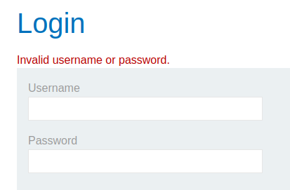
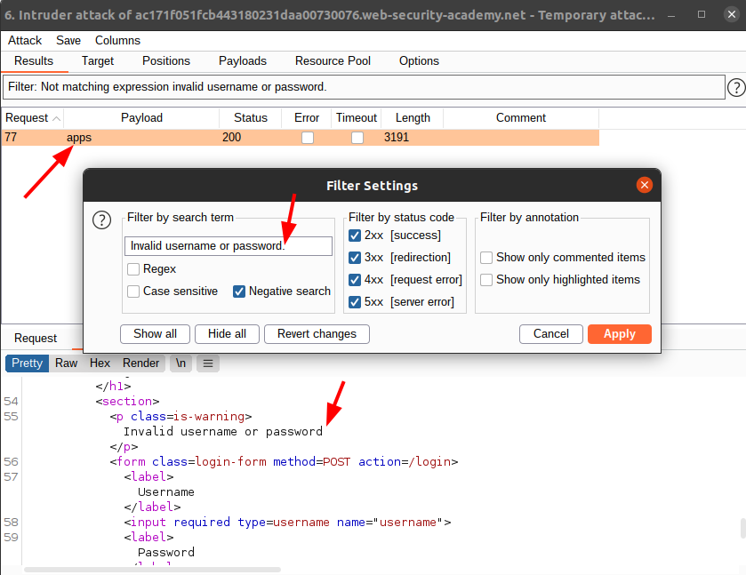

# Lab: Username enumeration via subtly different responses

Lab-Link: <https://portswigger.net/web-security/authentication/password-based/lab-username-enumeration-via-subtly-different-responses>  
Difficulty: PRACTITIONER  
Python script: [script.py](script.py)  

## Known information

- Login mechanism vulnerable to brute force
- Slight differences in responses
- Lists of possible usernames and passwords are provided
- Goals:
  - enumerate a valid user
  - brute force the corresponding password
  - login and access account page

## Enumerate username

As a first step, go to the page and try to login with some random username and password. This time, the error message is rather generic:

But perhaps the error message is hardcoded in two places, and on one there is a slight typo? Load the page in Burp Intruder, with the username as only payload.

Attack type: *Sniper*
Payload: *provided username list*

After running the enumeration, we need to find the valid usernames. The page shows `Invalid username or password.`. Lets use this exact string as negative filter and see if if there is a different message found.

And indeed, in one case the error message misses the full stop at the end.

Username found: **apps**

### Brute force password

Now repeat the step for the password until the correct password ist found

Attack type: *Sniper*
Payload: *provided password list*

On a successful login, the page redirects, so remove all responses with 2xx status codes (alternative, filter for responses not containing 'Invalid username or password'

### Login

Login with the username and password combination, or simply use Burps 'Request in browser' feature to avoid typing results in:

