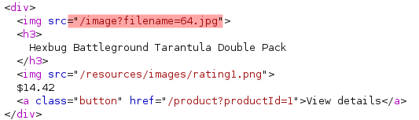

# Lab: File path traversal, traversal sequences blocked with absolute path bypass

Lab-Link: <https://portswigger.net/web-security/file-path-traversal/lab-absolute-path-bypass>  
Difficulty: PRACTITIONER  
Python script: [script.py](script.py)  

## Known information

- Directory traversal vulnerability in the product image display
- Application blocks traversal sequences
- Filenames are treated as relative to a default working directory
- Goals:
  - Retrieve contents of /etc/passwd

## Steps

### Analysis

The first step is as usual the analysis of the website. Like in the [previous lab](../File_path_traversal,_simple_case/README.md), the page references the product images as file names, indicating a possible path traversal vulnerability

As described in the lab description, simply requesting `../../../etc/passwd` does not lead to any file. The 'filenames are treated as relative to a default working directory' could be interpreted in different ways:

1. Default as defined within the application:

    The application prepends this default working directory to the requested filename before trying to access the file (e.g. something like `'/var/html/www/' + $_REQUEST["filename"]`, the hardcoded first part could be interpreted as 'default working directory')

2. Default as defined by the webserver:

    Alternatively, the application could rely on the fact that the execution of file system activities will always happen in the 'default working directory' of the webserver if no path is given. So when requesting `64.jpg`, which by itself is no path, it will assume the path of `/image` to look for the file.

    But when provided with an absolute path, than this path is used.

Assuming it is the second interpretation, than providing an absolute path should be the solution.

So load the page, send one of the image requests to repeater (ensure the filter does show image content) and request the `/etc/passwd` with its absolute path:

At the same moment the lab page updates to

