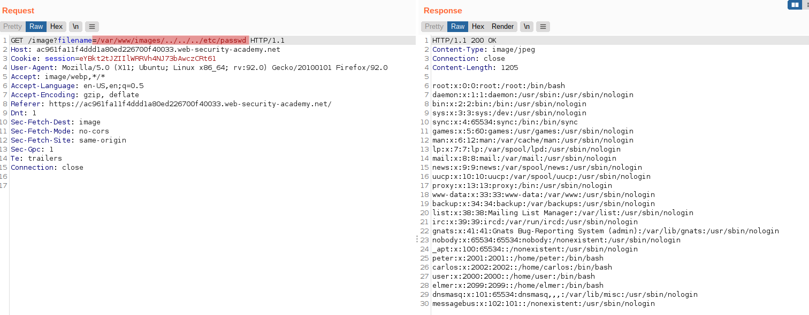

# Lab: File path traversal, validation of start of path

Lab-Link: <https://portswigger.net/web-security/file-path-traversal/lab-validate-start-of-path>  
Difficulty: PRACTITIONER  
Python script: [script.py](script.py)  

## Known information

- Path traversal vulnerability in the product images
- Application ensures that provided path starts within the expected folder
- Goals:
  - Retrieve content of /etc/passwd

## Steps

### Analysis

Like in the previous labs of the path traversal section, we start to analyse how the filenames for the images are provided. Here, the absolute path is provided in the HTML:

The application checks that the path starts with the expected values, in this case the absolute path `/var/www/images`, so neither different absolute paths (`/etc/passwd`) nor relative paths (`../../../etc/passwd`) are possible.

What the application lacks is any of the checks of the previous labs (not that they were ideal). So as long as the provided absolute path starts with the expected value, we can input any character sequence like backing out again with `../` until we reach the root.

While performing this request, the lab updates to

